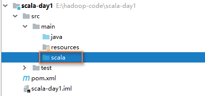

#  Scala

[TOC]


## 一、概述

> 1.Scala是一门多范式的静态类型编程语言,Scala支持面向对象和函数式编程
> 2.Scala源代码(.scala)会被编译成java字节码(.class)，然后运行在JVM之上，并可以调用现有的Java类库，实现两种语言的无缝对接 


## 二、搭建环境

### windows安装Scala

​    准备工作：安装JDK1.8,并且配置环境变量

1. 在c盘下创建一个scala文件夹

2. 双击scala-2.11.12.msi安装包 (安装路径不要有中文/空格)

   （包括所有跟软件开发相关的工具、环境在安装的时候，都）

3. 配置Scala的环境变量

   ```
   C:\scala\bin
   ```

4. 打开cmd窗口

   ```
   C:\Users\Administrator>scala
   Welcome to Scala 2.11.12 (Java HotSpot(TM) 64-Bit Server VM, Java 1.8.0_181).
   Type in expressions for evaluation. Or try :help.
   
   scala>
   ```


**Scala的REPL**

> 介绍:上面打开的scala命令行窗口,我们称之为REPL,是指:Read>Evaluation->Print->Loop,也称之为交互式解释器
> 说明:在命令行窗口中输入scala指令代码时,解释器会读取指令代码(R)并且计算对应的值(E),然后将结果打印出来(P),接着循环等待用户输入指令(L)。

示意图:


### Centos安装Scala

准备工作：安装JDK1.8,并且配置环境变量

  1. 上传scala的rpm安装包

     ```shell
     [root@CentOS ~]# rpm  -ivh scala-2.11.12.rpm
     Preparing...                ########################################### [100%]
        1:scala                  ########################################### [100%]
     [root@CentOS ~]# scala
     Welcome to Scala 2.11.12 (Java HotSpot(TM) 64-Bit Server VM, Java 1.8.0_171).
     Type in expressions for evaluation. Or try :help.
     scala>
     ```


### IDEA集成Scala

  

直接在线按照scala插件

在File>Setting> Plugins点击 `install plugin from disk`选项，选择 `scala-intellij-bin-2018.3.6.zip`安装成功后，重启IDEA。

  插件下载路径：<https://plugins.jetbrains.com/plugin/1347-scala/versions>


​	创建一个maven项目，然后项目右键选择`Add Framework Support` ,选择`Scala`


​	在src/main下创建scala文件夹，右键选择mark Directory  as ---> Sources Root




   在scala目录下创建一个HelloWorld的类,注意选择Object


在HelloWorld类中提供一个主函数，右键Run运行...


## 三、变量

### 1.声明变量

Scala声明变量有两种方式，一个用val，一个用var。

**val / var** **变量名 :** **变量类型 =** **变量值**。

var修饰变量值可以改变，val修饰常量 值不可改变等价于Java中final修饰的变量。

val示例：

```scala
scala> val a1 = 10
scala> a1 = 20（X）
```

var示例：

```scala
scala> var a2 = 10
scala> a2 = 20（OK）
```


### 2.数据类型

Scala语言是完全面向对象的语言，所以并不区分基本类型和引用类型，这些类型都是对象，我们称之为常用类型。

Scala常用类型中包含有7种数值类型：Byte、Char、Short、Int、Long、Float、Double及Boolean类型，还有String类型。

| 数据类型 | 描述                   |
| :------- | ---------------------- |
| Boolean  | true 或者 false        |
| Byte     | 8位, 有符号            |
| Short    | 16位, 有符号           |
| Int      | 32位, 有符号           |
| Long     | 64位, 有符号           |
| Char     | 16位, 无符号           |
| Float    | 32位, 单精度浮点数     |
| Double   | 64位, 双精度浮点数     |
| String   | 其实就是由Char数组组成 |

> 注：既然Java的基本类型数据在Scala中都是对象，
>
> ​       那么也就意味着Java中基本类型的数据在Scala中都是可以调用对象方法的。

```scala
scala> 1.toString
```

相对于Java的类型系统，Scala无疑要复杂的多!也正是这复杂多变的类型系统才让面向对象编程和函数式编程完美的融合在了一起！Scala中，所有的值都是类对象，而所有的类，包括值类型，都最终继承自一个统一的根类型**Any**。统一类型，是Scala的又一大特点。更特别的是，Scala中还定义了几个底层类（Bottom Class），比如**Null**和**Nothing**。

1)     Null是所有引用类型的子类型，而Nothing是所有类型的子类型。Null类只有一个实例对象，null，类似于Java中的null引用。null可以赋值给任意**引用类型**，但是不能赋值给**值类型**。

2)     Nothing，可以作为没有正常返回值的方法的返回类型，非常直观的告诉你这个方法不会正常返回，而且由于Nothing是其他任意类型的子类，他还能跟要求返回值的方法兼容。

3)     Unit类型用来标识过程，也就是没有明确返回值的函数。 由此可见，Unit类似于Java里的void。Unit只有一个实例，()，这个实例也没有实质的意义。


### 3.值类型转换

+ 自动类型转换

  介绍: 当Scala程序在进行赋值或者运算时，精度小的类型自动转换为精度大的数据类型，这个就是自动 类型转换 

  ```scala
  var i:Int = 10
  var j:Double = i     //自动类型转换
  
  自动提升原则:表达式结果的类型自动提升为操作数中最大的类型
  例如:
  var a1:Int = 10
  var a2:Double = 4.5
  var a3:Double = a1+a2
  
  (byte，short)和char之间不会相互自动转换，但是byte，short，char可以自动转换为int类型
  byte，short，char他们三者可以计算，在计算时先转换为int类型
  var a3:Byte = 10
  var a4:Short = 20
  var a5:Int = a3 + a4  //ok
  a4 = a3 + a4  //error
  ```

+ 强制类型转换

  介绍：自动类型转换的逆过程，将容量大的数据类型转换为容量小的数据类型。
  ​            使用时要加上强制转换函数，但可能造成精度降低或溢出，格外要注意。

  ```scala
  java:    int i = (int)2.5;
  scala:   var num:Int = 2.5.toInt
  ```

+ 值类型和string类型的转换

  介绍：在程序开发中，我们经常需要将基本数据类型转成String类型。
  或者将String类型转成基本数据类型

  ```scala
  语法: 基本类型的值 + “”
  var a2:String = 1 + ""    // 第二种：1.toString
  
  语法: 字符串转换成基本类型
  var s1:String ="12"
  var s2:Int = s1.toInt
  var s3:Byte = s1.toByte
  var s4:Short = s1.toShort
  var s5:Double = s1.toDouble
  var s6:Long = s1.toLong
  ```


### 4.运算符

+ 算术运算符(+  -  *  /  %)


+ 比较运算符


+ 逻辑运算符


+ 赋值运算符


> 注：Scala中没有++、--操作符，需要通过+=、-=来实现同样的效果。
>
> ​        没有三目运算符 【使用if代替】


### 5.控制台接收

```scala
import scala.io.StdIn

val i: Int = StdIn.readInt()
println(i)
```


## 四、程序的流程控制

### 分支控制

#### if else

```scala
if(条件){
  
}else if(条件){

}else{

}

例如:
var a=28
if(a<=10){
    println("child")
}else if(a<=18){
    println("boy|girl")
}else{
    println("man|woman")
}
```

>注：Scala中任意表达式都是有返回值的，也就意味着if else表达式其实是有返回结果的，具体返回结果的值取决于满足条件的代码体的最后一行内容

```scala
var a1 = 0
var res = if(a1 == 0){
       "男"
}else{
       "女"
}
println(res)
```


如果缺少一个判断，什么都没有返回，但是**Scala**认为任何表达式都会有值，对于空值，使用Unit类，叫做无用占位符，相当于java中的void, 打印结果为()，

```
val result =
    if(sumVal > 20){
    "结果大于20"
    }
println(result)
```

Java中表达式是没有值的，所以为了弥补这样的缺陷，就出现了三元运算符，但是Scala中是没有的，因为根本不需要。

```scala
// Java
int result = flg ? 1 : 0
// Scala
val result = if (flg) 1 else 0
```


#### match (模式匹配 )

​	  scala中的模式匹配类似于java中的switch语法，但是更加强大。
​	  模式匹配语法中，采用match关键字声明，每个分支采用case关键字进行声明，当需要匹配时，会从第一个case分支开始，如果匹配成功，那么执行对应的逻辑代码，如果匹配不成功，继续执行下一个分支进行判断。如果所有case都不匹配，那么会执行case_分支，类似于java中default语句

示例1：判断opr变量的值

```scala
var opr = "A"
opr match {
      case "A"  => println("1")
      case "B"  => println("2")
      case "C"  => println("3")
      case _    => println("default")
}

细节分析
① 如果所有的case都不匹配，那么会执行case_分支,类似于java中的default语句
② 如果所有的case都不匹配，又没有写case_分支，那么会抛出MatchError异常
③ 每个case中，不用break语句，自动中断case
④ 可以在match中使用其他类型，而不仅仅是字符串
⑤ => 等价于java switch的 :
⑥ => 后边的代码块到下一个case，是作为一个整体执行，可以使用{}扩起来，也可以不扩
```


### 循环控制

#### while和do while循环

```scala
while(条件){
  //循环体
  //循环变量迭代  
}

do{
  //循环体
  //循环变量迭代  
}while(循环条件)
```


#### for循环

1.范围数据循环 

```scala
for (i <- 1 to 10){   	 //前后闭合
	println(i)
}

for (i <- 1 until 10){    //前闭后开
	println(i)
}
```

2.循环守卫

```scala
特点：循环守卫，即循环保护式(也称条件判断式,守卫)。保护式为true则进入循环体内部,为false
则跳过
for (i <- 1 to 10 ; if i%2 ==0){
     println(i)
}
 
等价于
for (i <- 1 to 10){
   if (i%2 ==0){
      println(i)
   }
}
```

3.嵌套循环

```scala
for (i <- 1 to 2;j <- 1 to 3){
    println("i="+i+"  j="+j)
}
输出结果：
i=1  j=1
i=1  j=2
i=1  j=3
i=2  j=1
i=2  j=2
i=2  j=3


等价于
for (i <- 1 to 2){
    for(j <- 1 to 3){
        println("i="+i+"  j="+j)
    }
}
```

4.循环返回值

```scala
var res = for(i <- 1 to 10 ) yield i
println(res)

作用：将遍历过程中处理的结果返回到一个新Vector集合中,i这里是一个代码块,这就意味我们可以对i进行处理
输出结果:  Vector(1, 2, 3, 4, 5, 6, 7, 8, 9, 10)
```


### Break & Continue

Scala内置控制结构去掉了break和continue

① 推荐使用函数式风格解决break的功能，而不是一个关键字

```scala
import scala.util.control.Breaks

//breakable是一个高阶函数(可以接收函数的函数就是高阶函数)
//breakable对break()抛出的异常做了处理，代码就继续执行
//当我们传入的是代码块，scala程序员会将()改成{}
Breaks.breakable{
    for(i<- 1 to 9){
        if(i == 5){
          Breaks.break()
        }
        println(i)
	}
}
println("结束")


输出结果:	0	1	2	3	4	结束
```

② 可以使用if - else 或 循环守卫实现contine的效果

```
for(i <- 0 until 9 ; if ( i != 5 && i != 8) ){
      println(i)
}
 println("结束")
```


## 五、函数

scala定义函数的标准格式为：

```scala
def 函数名(参数名1: 参数类型1, 参数名2: 参数类型2) : 返回类型 = {
  函数体
}
```

### 1) 函数有返回值

```scala
def f1() : String= {
  return "f1"
}
```

> 注：Scala中的函数可以根据函数体最后一行代码自行推断函数返回值类型。那么在这种情况下，return关键字可以省略，既然Scala可以自行推断，所以在省略return关键字的场合，返回值类型也可以省略。
> 如果函数明确使用return关键字，那么函数无法省略返回值类型。


### 2) 函数无返回值

```scala
def f2() ：Unit = {
  println("f2")
}
```

> 注：如果函数明确声明无返回值（声明Unit），那么函数体中即使使用return关键字也不会有返回值。
> 如果明确函数无返回值或不确定返回值类型，那么返回值类型可以省略
>
> 将函数的返回类型为Unit的函数称之为过程(procedure)，如果明确函数没有返回值，那么等号可以省略


### 3) 函数有参数

```scala
def f4(p: String) = {
  println(p)
}
```

> 注：函数如果参数列表不为空，那么在调用时需要传递参数，不能省略，这和JavaScript语法不一样，在JavaScript中调用有参函数时，如果没有传递参数，那么参数会自动赋值为undefined,  Scala也可以实现类似的功能，就是在声明参数时，直接赋初始值。

```scala
def f5(p:String = "f5") {
    println(p);
}
```

调用函数时，如果不传递参数，就采用默认的初始值，如果传递参数，传递的参数会覆盖初始化。

```scala
f5() // 不传参数，打印f5
f5("function") // 传参, 覆盖默认值，打印function
```

如果函数存在多个参数，每一个参数都可以设定默认值，那么这个时候，传递的参数到底是覆盖默认值，还是赋值给没有默认值的参数，就不确定了(默认按照声明顺序)。在这种情况下，可以采用带名参数

```scala
def f6 ( p1 : String = "v1", p2 : String ) {
    println(p1 + p2);
}
f6("v2" )  // (Error)
f6(p2="v2") // (OK)
```


### 4) 变长参数

​    不确定个数参数，类似Java的...

```scala
def f7(args: Int*) = {
  var result = 0
  for(arg <- args)
    result += arg
  result
}
```


### 5)  惰性函数 

​     当函数返回值被声明为lazy时，函数的执行将被推迟，直到我们首次对此取值。这种函数我们称之为惰性函数，在Java的某些框架代码中称之为懒加载（延迟加载）

```scala
 def f10(): String = {
    println("22222")
    "hello" 
 }
 lazy val msg = f10()
 println("111111")
 println(msg)
```


### 6) 内嵌函数

​     在scala中函数中可以继续定义函数

```scala
def main(args: Array[String]): Unit = {
    def test1(): Unit ={
      println("测试")
    }
    test1()
}
```


### 7) 匿名函数

​	1.不需要写def 函数名

​    2.不需要写返回类型，使用类型推导

​    3.= 变成 => 

​	 4. 如果有多行则使用{}包括，否则建议省略	

```scala
//普通的函数
def test1(v1:Int,v2:Int):Int = {
    v1+v2
}

//匿名函数
(v1:Int,v2:Int) => v1+v2

//在scala中函数也是一个值，所以可以使用变量存储匿名函数
val f1 = (v1:Int,v2:Int) => v1+v2
f1(10,20)     //输出结果：30
```


### 8) 函数可以作为参数

​     在scala中，如果一个函数的参数，或者返回值是一个函数，那么这个函数可以称之为高阶函数

 ```scala
def main(args: Array[String]): Unit = {
    val i: Int = test1((a1,a2)=>a1-a2,10,20)
    println(i)
}

def test1(f1:(Int,Int)=>Int,v1:Int,v2:Int)={
    f1(v1,v2)
}
 ```


### 9) 函数可以作为返回值

```scala
def main(args: Array[String]): Unit = {
    val f1: (Int, Int) => Int = test1()
    f1(10,20)
 }

def test1():(Int,Int)=>Int ={
    (x:Int,y:Int)=>x+y
}
```


## 六、类和对象

### 1.定义类

```scala
[修饰符] class 类名{
   类体
}

class Student {

}
```

> 1.scala语法中，类并不声明为public,所有这些类都具有公有可见性(默认就是public)
> 2.一个scala源文件可以包含多个类，而且默认都是public

### 2.属性

```scala
class Student {

  var name:String = _

  var age:Int = 0

  def show(): Unit ={
    println(s"$name,$age")
  }

}
```

> 1.属性的定义语法同变量    [访问修饰符] var 属性名 [:类型] = 属性值
> 2.属性的定义类型可以为任意类型, 包含值类型或者引用类型
> 3.scala中声明一个属性，必须显示的初始化，然后根据初始化数据的类型自动推断，属性类型可以省略
> 4.如果赋值为null，则一定要加类型，因为不加类型，那么该属性的类型就是Null类型
> 5.如果在定义属性时，暂时不赋值，也可以使用符号_，由系统分配默认值、

| 类型                   | _ 对应的值 |
| ---------------------- | ---------- |
| Byte、Short、Int、Long | 0          |
| Float、Double          | 0.0        |
| String和引用类型       | null       |
| Boolean                | false      |


给某个属性加入@BeanProperty注解后,会生成getXXX和setXXX方法 [了解]

```scala
class Student (@BeanProperty name:String){

  @BeanProperty
  var age:Int = _

  ...
}
```


### 3.创建对象

```scala
val|var 对象名[:类型] = new 类型()

val student:Student= new Student()
```

>1.如果我们不希望改变对象的引用(内存地址),应该声明为val性质的,否则声明为var,scala设计者推荐使用val,因为一般来说,在程序中,我们只是改变对象属性的值,而不是改变对象的引用
>2.scala在声明对象变量时,可以根据创建对象的类型自动推断,所以类型声明可以省略,但当类型和后边new对象类型有继承关系即多态时，就必须写了

### 4.方法

​    scala中的方法其实就是函数

```scala
语法
def 方法名(参数列表)[:返回值类型] = {
    方法体
}

//在Student类中定义方法
def show(): Unit ={
    println(s"$name,$age")
}
```

### 5.构造器

​	和java一样，scala构造对象也需要调用构造方法，并且可以有任意多个构造方法(即scala中构造器也支持重载)
scala类的构造器包括：主构造器 和 辅助构造器

```scala
class 类名(形参列表){  //主构造器

   def this(形参列表){   //辅助构造器
   }
   
   def this(形参列表){   //辅助构造器可以有多个
   }
}

class Student(name2:String){

  var name:String = name2

  var age:Int = 0

  def this(name:String,age:Int){
    this(name)  // 辅助构造器必须在第一行显示调用主构造器(可以是直接，也可以是间接)
    this.age = age
  }
  
  def show(): Unit ={
    println(s"$name,$age")
  }

}
```


1. 如果主构造器无参数，小括号可以省略，构建对象时调用的构造方法的小括号也可省略

   ```scala
   class Student{
       
   }
   val s = new Student
   ```

2. 主构造器会执行类定义中的所有语句

   ```scala
   class Student{
       
       println("啦啦啦啦~~~")
   }
   
   val s = new Student  //控制台打印  啦啦啦啦~~~
   ```

3. 如果想让主构造器变成私有的，可以在()之前加上private,这样用户只能通过辅助构造器来构造对象了

   ```scala
   class Student private(){}
   ```

4. 主构造形参修饰

   ```scala
   scala类的主构造器的形参未用任何修饰符修饰，那么这个参数是局部变量.
   如果参数使用val关键字声明，那么scala会将参数作为类的私有的只读属性使用
   如果参数使用var关键字声明，那么scala会将参数作为类的成员属性使用，并会提供属性对应的
     xxx()[类似于getter]/xxx_$eq()[类似setter]方法，即这时的成员属性是私有的，但是可读性
   
   class Student (var name:String){
   
     var age:Int = _
   
     def this(name:String,age:Int){
       this(name)
       this.age = age
     }
   
     def show(): Unit ={
       println(s"$name,$age")
     }
   
   }
   ```


## 七、面向对象三大特征

### 1.封装

```scala
//使用private 修饰属性后，生成的setter/getter方法也是private
private var age:Int = _

//声明age属性的set和get方法
def setAge(age:Int):Unit={
    if(age > 0 && age < 100){
      this.age = age
    }
  }

def getAge(): Int ={
    
    return age
}
```

### 2.继承

1. 继承父类语法

   ```scala
   class 子类名 extends 父类名{ 类体 }
   ```

2. 重写父类方法

   ```scala
   重写父类方法需要使用override修饰
   override def xxx(): Unit ={
     
   }
   ```


### 3.多态

多态：多种形态。

编译时类型以及运行时类型

```scala
要测试某个对象是否属于某个给定的类，可以用isInstanceOf方法。
用asInstanceOf方法将引用转换为子类的引用

var s:Person = new Student
if(s.isInstanceOf[Student]){
    val student: Student = s.asInstanceOf[Student]
    student.study()
}
```

用途：

1. 父类类型作为方法形参：可以接收所有的子类类型对象
2. 父类类型作为方法返回值类型：可以返回所有的子类类型对象

## 八、抽象类 

在scala中，通过abstract关键字标记不能被实例化的类。方法不用标记abstract，只要省掉方法体即可

```scala
abstract class Person{

  var name:String = _

  def sayHello()
    
  //def sayHello():Unit = ???

}
```


## 九、接口 trait

1. 声明一个特质 trait

   ```scala
   trait 特质名{
       trait 体
   }
   ```

2. 使用特质

   ```scala
   1) 没有父类，可以直接继承特质
   class 类名 extends 特质1 with 特质2
   2) 有父类
   class 类名 extends 父类 with 特质1 with 特质2
   
   
   trait A{
     def test1()
   }
   
   trait B{
     def test2()
   }
   
   class C extends  A with B{
   
     override def test1(): Unit = {
       println("覆盖特质A的test1方法")
     }
   
     override def test2(): Unit = {
       println("覆盖特质B的test2方法")
     }
   
   }
   ```

> 因为Scala运行在Java8之上，所以特质中方法可以有默认实现

3. 动态混入

   ```scala
   class Pig(name:String) extends  Animal(name:String) with Speakable{
     override def speak(): Unit = {
       println("哼哼~")
     }
   
     override def eat(): Unit = {
       println(s"${name} 给啥吃啥~")
     }
   }
   ```

   ```scala
   var pig=new Pig("猪坚强") with Flyable{
       override def fly(): Unit = {
           println(s"${name} 会飞了~")
       }
   }
   
   pig.fly()
   ```


## 十、静态属性和静态方法

介绍：由于Scala没有静态方法，通过object去定义静态方法或者静态对象。

### 单例类

单例类使用object修饰，所有声明在object中的方法都是静态方法，类似于Java中声明的工具类的作用。

```scala
object SingleObject {
    def sum(x:Int,y:Int):Int={
      x+y
    }
}
```

```scala
var so1=SingleObject
var so2=SingleObject

println(so1==so2) //true
SingleObject.sum(1,2)
```

### 伴生对象 

如果类和object在一个scala文件中，则称为object User 是class User的伴生对象

```scala
class User{
    
}
//Scala中伴生对象采用object关键字声明，伴生对象中的全是”静态“内容，可以通过伴生对象名称直接调用
//伴生对象对应的类称之为伴生类，伴生对象的名称应该和伴生类名一致
//伴生对象中的属性和方法都可以伴生对象(类名)直接调用访问
//从语法角度来讲，所谓的伴生对象其实就是类的静态方法和成员的集合
object User{  //伴生对象
    
}
```


### 伴生对象 apply方法

使用伴生对象可以方便的创建对象，只需要覆盖对应的apply方法，如下：

```scala
class User {

  def test2(): Unit ={
    println("test2方法execute")
  }

}

object User{

  def apply(): User = {
    println("11111111")
    new User()
  }

}

测试：
val user = User()   //或者 val user = User.apply()
user.test2()
```


## 十一、隐式传值和隐式转换

隐式意义相反的一个词：显式

显式：自己写。显式调用---》写代码调用

隐式：不用写。隐式调用---》不用写代码，只要有就自动完成调用

### 1.隐式函数

```scala
def main(args: Array[String]): Unit = {

    implicit def f1(d:Double):Int = {
      d.toInt
    }

    val num:Int = 3.5
    println(num)

}
```

### 2.隐式变量

```scala
def main(args: Array[String]): Unit = {

    implicit var name:String = "tom"

    def hello(implicit name:String): Unit ={
      println(name + " say hello")
    }

    hello
}
```

> 隐式变量的优先级高于默认值

### 3.隐式类

```scala
object Demo3 {

  def main(args: Array[String]): Unit = {

    implicit class A(val b:B){
      def test2(): Unit ={
        println("test2方法执行了")
      }
    }

    var b = new B
    b.test2()

  }

}

class B{
  def test1(): Unit ={
    println("test1方法执行了")
  }
}

```

> 隐式类的要求
>
> - 只能在别的trait/类/对象内部定义
> - 构造函数只能携带一个非隐式参数
> - 在同一作用域内，不能有任何方法、成员或对象与隐式类同名。


## 十二、异常 

​	Scala提供try和catch块来处理异常。try块用于包含可疑代码。catch块用于处理try块中发生的异常。可以根据需要在程序中有任意数量的try...catch块。
​	语法处理上和Java类似，但是又不尽相同。

```scala
// Scala
try {
     val r = 10 / 0
} catch {
     case ex: ArithmeticException=> println("捕获了除数为零的算数异常")
     case ex: Exception => println("捕获了异常")
} finally {
     // 最终要执行的代码
}
```

Scala的异常的工作机制和Java一样，但是Scala没有“checked”异常，你不需要声明说函数或者方法可能会抛出某种异常。受检异常在编译器被检查，java必须声明方法所会抛出的异常类型。
在Scala里，借用了模式匹配的思想来做异常的匹配，因此，在catch的代码里，是一系列case子句。


## 十三、集合

概述: scala同时支持不可变集合和可变集合，不可变集合可以安全的并发访问

 	   两个主要的包: 不可变集合: scala.collection.immutable
​				    可变集合: scala.collection.mutable


### 1.Array (不可变数组)

1. 定义数组

   ```scala
   var arr1 = new Array[String](3)
   arr1(0) = "zhangsan"
   arr1(1) = "lis"
   arr1(2) = "wangwu"    
   
   var arr2 = Array(1,2,3)   //省略new，底层通过伴生对象的apply方法构建Array对象
   ```

2. 获取元素

   ```scala
   //根据下标获取
   arr1(0)
   
   //遍历
   for (elem <- arr1) {
       println(elem)
   }
   
   //求数组长度
   arr1.length  // 或者 arr1.size 
   ```


### 2.ArrayBuffer(可变数组)

1. 定义数组

   ```scala
   var arrayBuffer = new ArrayBuffer[Int]()
   ```

2. 增删改元素

   ```scala
   //添加元素
   arrayBuffer += 1
   arrayBuffer.append(2)
   //修改元素  根据下标修改指定位置元素
   arrayBuffer(1) = 5
   //删除元素  根据下标删除指定位置元素
   arrayBuffer.remove(1)
   ```

3. 获取元素

   ```scala
   //根据下标获取
   arrayBuffer(0)
   
   //遍历
   for (elem <- arrayBuffer) {
       println(elem)
    }
   ```

4. 小结

   ```scala
   arr1.toBuffer   //定长数组转可变数组
   arr2.toArray    //可变数组转定长数组
   
   注意： arr1.toBuffer 返回结果才是一个可变数组，arr1本身没有变化
         arr2.toArray  返回结果才是一个定长数组，arr2本身没有变化
   ```


### 3.Tuple (元组)

​	介绍：元组也是可以理解为一个容器，可以存放各种相同或不同类型的数据

1. 构建元组对象

   ```
   val t1 = ("zhangsan",12,"lisi",11.2)
   ```

   > 元组是不可变的，最多可以存储22个元素

2. 访问元组中的元素

   ```scala
   println(t1._1)    //输出：zhangsan
   println(t1._2)    //输出：12
   ```

3. 遍历元组

   ```scala
   for (elem <- t1.productIterator) {
         println(elem)
   }
   ```


### 4.List (不可变列表)

​	介绍：Scala中的List和Java List不一样，在Java中List是一个接口，真正存放数据是ArrayList,而Scala的List可以直接存方数据。默认情况下scala的List是不可变的，List属于序列Seq。

1. 构建List对象

   ```scala
   val list1 = List(1,2,3,4)   
   
   val list1 = Nil    //空集合  List()
   ```

2. 访问List中元素

   ```scala
   //根据下标获取
   list1(0)
   ```

3. 添加

   向列表中增加元素，会返回新的列表/集合对象。

   注意：scala中List元素追加形式非常独特，和Java不一样

   ```scala
   //通过 :+ 和 +: 给list追加元素(本身list集合并没有变化)
   val list2: List[Int] = list1 :+ 10
   println(list2)     //输出结果: List(1, 2, 3, 4, 10)
   
   val list3: List[Int] = 20 +: list1
   println(list3)    //输出结果: List(20, 1, 2, 3, 4)
   
   //符号::表示向集合(新建)中添加元素
   //运算时,集合对象一定要放置在最右边，且运算规则是，从右至左
   //:::运算符是将集合中的每一个元素加入到集合中去
   val list1 = List(1,2,3,4)
   var list5 = 6::7::list1::Nil
   //分析过程
   //1). List()  2). List(List(1,2,3,4)) 
   //3). List(7,List(1,2,3,4))  4). List(6,7,List(1,2,3,4)) 
   println(list5)			//输出结果: List(6, 7, List(1, 2, 3, 4))
   
   var list6= 6::7::list1:::Nil
   println(list6)			//输出结果: List(6, 7, 1, 2, 3, 4)
   ```


### 5.ListBuffer (可变列表)

​	介绍：ListBuffer是可变的list集合，可以添加，删除元素，ListBuffer属于序列

1. 创建ListBuffer对象

   ```scala
   var listBuffer = ListBuffer[Int](1,2,3)
   或者
   var listBuffer = ListBuffer[Int]
   ```

2. 增删元素

   ```scala
   //向集合中添加一个元素
   var listBuffer2 = ListBuffer[Int]()
   listBuffer2 += 4
   listBuffer2.append(5)
   println(listBuffer2)			//输出结果: ListBuffer(4, 5)
   
   //向集合中添加另外一个集合
   var listBuffer = ListBuffer[Int](1,2,3)
   listBuffer ++= listBuffer2
   println(listBuffer)			    // 输出结果：ListBuffer(1, 2, 3, 4, 5)
   
   //根据下标移除数据
   var listBuffer = ListBuffer[Int](1,2,3)
   listBuffer.remove(0)
   println(listBuffer)			    // 输出结果：ListBuffer(2, 3)
   
   //根据下标修改数据
   var listBuffer = ListBuffer[Int](1,2,3)
   listBuffer(0) = 10
   println(listBuffer)			    // 输出结果 ListBuffer(10, 2, 3)	
   ```

3. 访问ListBuffer中的元素

   ```scala
   //根据下标获取指定位置的元素
   listBuffer(0)  
   
   //遍历
   var listBuffer = ListBuffer[Int](1,2,3)
   for (elem <- listBuffer) {
         println(elem)
   }
   ```


### 6.Map

​	介绍：scala中的Map和java类似，也是一个散列表，它存储的内容也是键值对(k-v)映射,scala
​			中不可变的Map是有序的，可变的Map是无序的

​                	 Scala中有可变的Map(scala.collection.mutable.Map)

​                                     不可变Map(scala.collection.immutable.Map)

1. 构建Map对象，map中存储的元素本质是一个tuple

   ```scala
   val map1 = Map("a1"->"zhangsan","a2"->"lisi")   	   //不可变
   println(map1)
   
   val map2 = mutable.Map("a1"->"zhangsan","a2"->"lisi")   //可变
   println(map2)
   
   val map3 = new mutable.HashMap[String,String]()         //创建空的Map
   ```

2. 添加 & 修改

   ```scala
   val map2 = mutable.Map("a1"->"zhangsan","a2"->"lisi")
   //key不存在，执行添加。否则是修改
   map2("a3") = "wangwu"
   map2.put("a4","zhaoliu")
   ```

3. 取值

   ```scala
   //创建一个map
   val map2 = mutable.Map("a1"->"zhangsan","a2"->"lisi")
   
   ①. map("key")
   作用：如果key存在，则返回对应的值
        如果key不存在,则抛出异常[java.util.NoSuchElementException]
   	注意:在java中，如果key不存在则返回null
   例如：map2("a1")   输出:zhangsan
        map2("x1")   抛出异常
   
   ②. map.get("key")
   作用：map集合中的get方法会返回Option对象,如果key存在是Some，否则是None
   例如：map2.get("a1")   输出:Some(zhangsan)
        map2.get("x1")   输出:None
   
   ③. map.get("key").getOrElse([默认值])
   作用：如果是Some，getOrElse可以返回key对应的value，否则返回默认值
        如果getOrElase没有给定默认值，则返回() (()是Unit的唯一实例)
   例如：map2.get("a1").getOrElse（）   输出:zhangsan
        map2.get("x1").getOrElse（）   输出:()
        map2.get("x1").getOrElse（null）   输出:null
   简写：map2.getOrElse("key",null)
   
   ④. map.contains("key")
   作用： 判断key是否存在，存在返回true，否则返回false
   
   使用技巧：如果我们确定map有这个key，应当使用map(key)
           如果不能确定，则先使用map.contains(key)判断
           如果只是期望获取一个值，可以使用map.getOrElse(key,默认值)
   ```

4. 删除

   ```scala
   方式1：map -= (key,key)   // -= 这种形式可以一次删除多个key-value
   
   方式2：map.remove(key)
   
   注意： 如果key存在则删除，不存在也不会报错
   ```

5. 遍历

   ```scala
   键值对遍历
   方式1：k,v是两个变量，接收map遍历获取的key-value
   for ((k,v) <- map) {
         println(k +"\t" + v)
   }
   方式2：elem获取map遍历出的元祖，elem可以通过操作元祖的形式获取key-value
   for (elem <- map) {
       println(elem._1 + "\t" + elem._2)
   }
   
   键遍历
   for (elem <- map.keys) {
         println(elem)
   }
   
   值遍历
   for (elem <- map.values) {
         println(elem)
   }
   ```


### 7. Set

​	介绍：Set存储的元素不允许重复，且不保留顺序，默认是以哈希Set实现

1. 构建Set对象

   ```scala
   import scala.collection.mutable
   
   val set1 = Set(1,3,2)             //不可变
   
   val set2 = mutable.Set(1,3,2)     //可变
   ```

2. 向集合中添加、删除元素

   ```scala
   //三种向集合添加元素的方式
   val set2 = mutable.Set(1,2,3)     //可变
   set2.add(4)
   set2 += 5
   
   //两种从集合中移出元素的方式
   set2 -= 2
   set2.remove(3)
   ```
   
3. 集合遍历

   ```scala
   for (elem <- set2) {
         println(elem)
   }
   ```


### **Option**

```scala
object Test8_Option {

  def main(args: Array[String]): Unit = {
    //Option 是一个抽象类   它有两个子类  Some (有) 和  None (没有)
    /**
     * Option
     *       get        作用：获取值
     *       getOrElse  作用: 获取值，获取到直接返回，如果获取不到则返回默认值
     *
     * Some对象 调用get方法可以获取里面存储的值
     *         调用getOrElse(默认值)方法，还是返回Some对象本身存储的值
     *
     * None对象 调用get方法报报错
     *         调用getOrElse(默认值)方法，返回默认值
     */
     var s = Some(1)
     println(s.getOrElse(2))  //输出1

     var s2 = None
     println(s2.getOrElse(2)) //输出2

     val option = test1(2) //如果调用一个方法，返回值是Option类型，你能够保证他的实际类型是Some，那么你就可以调用get方法，否则建议使用getOrElse方法
     println(option.getOrElse("匿名"))
  }

  def test1(i:Int) = {
     if(i == 1){
       Some("张三")
     }else{
       None
     }
  }

}
```


## 十四、scala自带高阶函数

概述：可以接收一个函数的函数就是高阶函数，又称为算子

### 1.map

介绍：将集合中的每一个元素通过指定功能(函数)映射(转换)成新的结果集

需求：请将List(1,2,3)中的所有元素都*2,将结果放到一个新的集合中返回，即返回一个新的List(2,4,6)

①. 传统做法：遍历list集合，获取每一个元素*2，放入新的集合中

```scala
val list1 = List(1,2,3)
var list2 = List[Int]()
for (elem <- list1) {
    list2 = list2 :+ elem*2
}
println(list2)		//List(2, 4, 6)
```

> 传统写法总结：优点是比较直接、好理解  
>
> ​                            缺点是不够简洁、高效，没有体现函数式编程特点

②. 使用map函数

```scala
val list1 = List(1,2,3)
val list2 = list1.map(v=>v*2)
println(list2)			//List(2, 4, 6)
```

③. 模拟实现map函数

```scala
class MyList {

  var list1 = List(1,2,3)

  var list2 = List[Int]()

  def map(f:Int=>Int): List[Int] ={
    for (elem <- list1) {
      list2 = list2 :+ f(elem)
    }
    list2
  }
}

object MyList{
  def apply(): MyList = new MyList()
}
```

测试

```scala
var myList = MyList()
val list2: List[Int] = myList.map(v=>v*2)
println(list2)
```

### 2.flatten

介绍：flat即压扁，压平，扁平化。效果就是将集合中的每个元素的子元素映射到某个函数并返回新的集合	

```scala
var list = List(List(1,2,3),List(3,4,5))
val list2 = list.flatten
println(list2)          // 输出结果：List(1, 2, 3, 3, 4, 5)

val list3 = List(Array("zhangsan","lisi"),Array("lisi","wangwu"))
println(list3.flatten)
```

### 3.flatMap

介绍：先执行map，在执行flatten

```scala
var list = List("zhangsan lisi","lisi wangwu","wangwu wangwu")
val list2 = list.flatMap(v=>v.split(" "))
println(list2)    //输出：List(zhangsan, lisi, lisi, wangwu, wangwu, wangwu)
```

### 4.filter 

介绍：将符合要求的数据，通过指定函数的筛选放置到新的集合中

需求：将集合中首字母为‘A’的筛选到新的集合

```scala
var list = List("Alice","Tom","Jack","Abc")
val list2 = list.filter(v => {
   v.startsWith("A")
})
println(list2)			//输出结果：List(Alice, Abc)
```

### 5.reduce

介绍：对集合中的元素进行归约操作

需求：计算List集合中所有元素的和

```scala
var list = List(1,2,6,8)
val i: Int = list.reduce((v1,v2)=>v1+v2)
println(i)
```

### 6.fold

介绍：fold函数将上一步返回的值作为函数的第一个参数继续传递参与运算

需求:  计算List集合中所有元素的和

```scala
var list = List(1,2,6,8)
val i: Int = list.fold(5)((v1, v2) => {
      v1 + v2
})
println(i)

上述代码等同于
list(5,1,2,6,8).reduce((v1, v2) => {
      v1 + v2
})
```

### 7.sorted

介绍：对集合中的元素进行排序

```scala
var list = List(1,13,4,34)
println(list.sorted)            	//输出结果 List(1, 4, 13, 34)
println(list.sorted.reverse)		//输出结果 List(34, 13, 4, 1)
```

### 8.sortBy

介绍：对集合中元组的某个元素进行排序

```scala
//List集合中存储一个学生的信息，分别是姓名和语文成绩，请按照语文成绩排序
var list = List(("张三",100),("李四",84),("王五",95),("赵六",30))
println(list.sortBy(t => t._2))			//List((赵六,30), (李四,84), (王五,95), (张三,100))
println(list.sortBy(t => t._2).reverse) //List((张三,100), (王五,95), (李四,84), (赵六,30)


//List集合中存储一个学生的信息，分别是姓名和语文成绩、数学成绩
//请按照语文成绩先排序，语文成绩相等者,按照数学成绩排序
var list2 = List(("张三",100,58),("李四",84,96),("王五",84,75),("赵六",30,61))
println(list2.sortBy(v => (v._2, v._3))(Ordering.Tuple2(Ordering.Int,Ordering.Int.reverse)))

//输出结果：List((赵六,30,61), (李四,84,96), (王五,84,75), (张三,100,58))
```

### 9.groupBy

介绍：根据集合中包含元组进行分组

```scala
var list = List(("张三",100),("张三",96),("李四",84),("李四",30))
//.groupBy(v=>v._1) 作用：根据遍历集合获取元组的第一个元素进行分组
val map: Map[String, List[(String, Int)]] = list.groupBy(v=>v._1)
println(map)

//Map(张三 -> List((张三,100), (张三,96)), 李四 -> List((李四,84), (李四,30)))
```

### 10.foreach

介绍：遍历集合中的元素

```scala
var list = List("张三","李四","王五")
list.foreach(v=>{
   println(v)
})
```


 关于高阶函数的形参(匿名函数)的写法

```
val list = List(1,2,3)
1.正常的写法
  list.map( (v:Int) => v*2 )
  
2.如果可以正常推断出匿名函数的形参类型，则:Int可以省略
  list.map( (v) => v*2 )
  
3.如果匿名函数的形参个数只有1个，则()小括号可以省略
  list.map( v => v*2 )
  
  list.reduce( (v1,v2) => v1+v2 )    //此处(v1,v2)对应的小括号不能省略

4.如果匿名函数的形参(每一个)，在匿名函数的代码体中只出现一次，则可以将形参列表和=> 省略，并且在函数体中使用_代表形参
  list.map( v => v*2  )   对应简写  list.map( _*2  )
  list.map( v => v*v )    不能使用_简写
  
  list.reduce( (v1,v2) => v1+v2 )  对应简写   list.reduce( _+_ )
```


## 十五、函数高级  

### 1.闭包 

> 闭包是一个函数，返回值依赖于声明在函数外部的一个或多个变量。
> 闭包通常来讲可以简单的认为是可以访问一个函数里面局部变量的另外一个函数

介绍: 闭包就是一个函数和与其相关的引用环境组合的一个整体

闭包演示

```scala
def minus(x:Int)= (y:Int)=> x-y

val f1 = minus(20)   //此处的f1就是闭包
f1(1)  //输出19
f1(2)  //输出18

详解：
①  (y:Int)=> x-y 
     代表minus这个函数的返回值是一个匿名函数，那么将来这个匿名函数执行时就需要引入外部环境变量x
     这就形成了闭包
②  当多次调用f(可以理解多次调用闭包) 发现使用的是同一个x，所以x不变
③  在使用闭包时，主要搞清楚返回函数引用了函数外的哪些变量，因为他们会组合成一个整体
    
```

闭包实践：设计一个函数makeSuffix(suffix:String) 可以接收一个文件后缀名(比如.jpg) 并返回一个闭包

调用闭包，可以传入一个文件名，如果该文件名没有指定后缀，则返回文件名.jpg，否则直接返回原文件名

```scala
def makeSuffix(suffix:String) = {
      (fileName:String)=>{
        val bool: Boolean = fileName.endsWith(suffix)
        if(bool) fileName else fileName+".jpg"
      }
}

val f2 = makeSuffix(".jpg")
println(f2("aaa.jpg"))     //输出aaa.jpg
println(f2("heihei"))      //输出heihei.jpg
```


### 2.函数柯里化

介绍：函数编程中，接受多个参数的函数都可以转化为接收单个参数的函数，这个转化过程就叫柯里化

柯里化就是证明了函数只需要一个参数而已，不用设立柯里化存在的意义这样的命题。柯里化就是以函数为

主体这种思想发展的必然产生结果

需求：编写一个函数，接收两个整数，可以返回两个数的乘积

```scala
//常规方式完成
def test1(v1:Int,v2:Int)={
    v1+v2
}
test1(10, 20)

//闭包
def test2(x:Int)= (y:Int)=>x+y
test2(10)(20)

//柯里化
def test3(x:Int)(y:Int)={
    x+y
}
test3(10)(20)
```


## 补充（面试题）

> 怎么理解这一行代码?
>
> var arr:Array[Int]=Array(1,2,3)
>
> 不通过new关键，直接创建对象，其实是伴生对象的使用
>
> //就是调用了Array中的apply方法
>
> //scala源代码中提供的有class Array以及object Array;就构成了伴生对象，在object Array里面提供的apply方法可以用来创建Array对象，上面的这一行代码就是伴生对象的使用，其实就是用了对应的apply方法
>
> 
>
> 如果代码这样写---》var arr:Array[Int]=new Array(1,2,3)


 