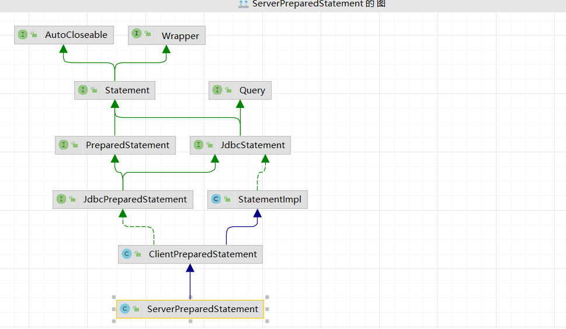
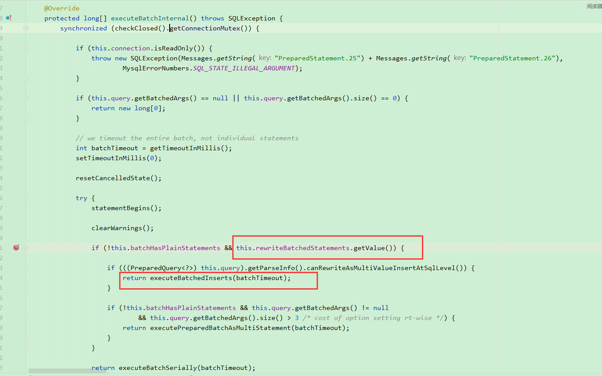
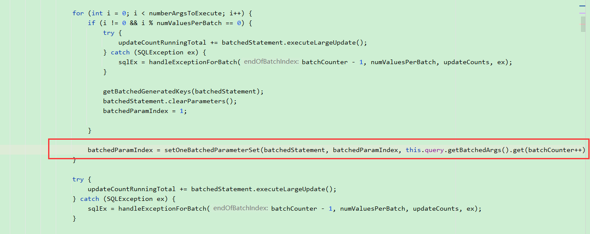
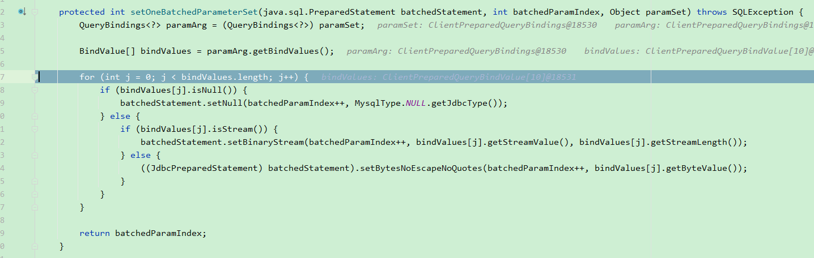
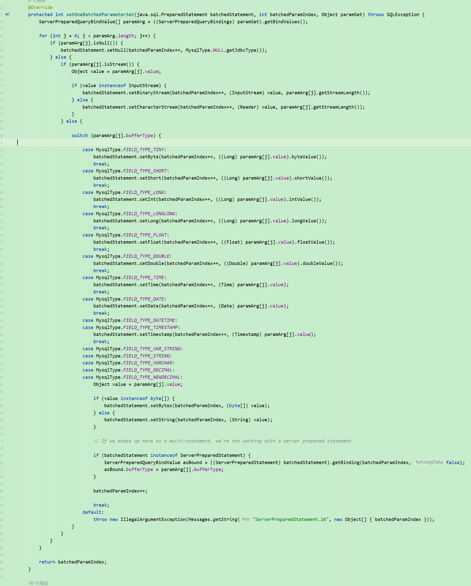

# mysql大数据量查询/插入

## 前言:

环境:

mybatis-plus  3.4.1

mybatis 3.5.6

mysql-connector-java  8.0.16  (mysql的jdbc驱动)

mysql 8.0.28  (数据库server, 这里看出驱动老了几个小版本)

druid 1.2.11  (之前使用低版本1.1.9, 流式查询有兼容性问题直接报错,  1.2.10版本 [解决了流式查询的一个错误日志](https://github.com/alibaba/druid/issues/3641))

## 一、查询

[官方文档](https://dev.mysql.com/doc/connector-j/8.1/en/connector-j-reference-implementation-notes.html), 其中的**ResultSet**栏目有大批量数据查询的相关介绍

[CSDN文章1](https://blog.csdn.net/xieyuooo/article/details/83109971/), 这篇文章有对原理以及优缺点进行介绍

[CSND文章2](https://www.cnblogs.com/logicbaby/p/4281100.html), 这篇文章也值得参考

### 1. stream读取(Client Side Cursor)

该方法压力在客户端, 且在数据未消费完的情况下, 使用的连接无法进行其他查询, 否则会报错, 具体使用看业务

如果您使用的 ResultSet 具有大量行或较大值，并且无法在 JVM 中分配堆空间来满足所需内存，则可以告诉驱动程序一次将结果流回一行。

要启用此功能，请 `Statement`按以下方式创建实例：

```
stmt = conn.createStatement(java.sql.ResultSet.TYPE_FORWARD_ONLY, java.sql.ResultSet.CONCUR_READ_ONLY);
stmt.setFetchSize(Integer.MIN_VALUE);
```

这种方法有一些注意事项。**您必须先读取结果集中的所有行（或关闭它），然后才能在连接上发出任何其他查询，否则将引发异常**。

这些语句所持有的锁（无论是`MyISAM`表级锁还是其他存储引擎（例如 `InnoDB`）中的行级锁）最早可以在语句完成时释放。

如果该语句在事务范围内，则当事务完成时将释放锁（这意味着该语句需要首先完成）。与大多数其他数据库一样，只有读取该语句上的所有待处理结果或关闭该语句的活动结果集后，语句才算完成。因此，如果使用流式结果，并且**想要保持对生成结果集的语句所引用的表的并发访问，请尽快处理它们**。

### 1.1 基于mybatis实现

```
    import org.apache.ibatis.annotations.Options;
    import org.apache.ibatis.annotations.Param;
    import org.apache.ibatis.annotations.Select;
    import org.apache.ibatis.cursor.Cursor;
    import org.apache.ibatis.mapping.ResultSetType;

    @Select("select batch, code from code where order_id = #{orderId}")
    @Options(fetchSize = Integer.MIN_VALUE, resultSetType = ResultSetType.FORWARD_ONLY)
    Cursor<CodeExportDto> findCodeAndBatchByOrderId(@Param("orderId") String orderId);

    @Transactional(rollbackFor = Exception.class)
    @Override
    public String exportCode(CodeExportTask codeExportTask) {
        try (Cursor<CodeExportDto> cardCodeCursor = codeDao.findCodeAndBatchByOrderId(codeExportTask.getRelId())) {
        
            });
        } catch (IOException e) {
        }
    }
```

在取数据的过程中需要保持数据库连接，而 Mapper 方法通常在执行完后连接就关闭了，因此 Cusor 也一并关闭了。所以，解决这个问题的思路不复杂，保持数据库连接打开即可. 这里开启了事务, 会保持连接, 也可以采用手动开启/关闭连接的方式.

### 2. **useCursorFetch**基于游标的流式传输(**Server Side Cursor**)

该方法压力在mysql服务端, 在数据未消费完的情况下, 使用的连接可以进行其他查询, 具体使用看业务

使用基于游标的流式传输来每次检索一定数量的行。这可以通过将连接属性设置 `useCursorFetch`为 true，然后调用 `setFetchSize(int)`每次 `int`获取所需的行数来完成(这里的数量需要根据实际情况调整, 太小速度会慢)：

```
conn = DriverManager.getConnection("jdbc:mysql://localhost/?useCursorFetch=true", "user", "s3cr3t");
stmt = conn.createStatement();
stmt.setFetchSize(100);
rs = stmt.executeQuery("SELECT * FROM your_table_here");
```

### 2.1 mybatis中的实现

连接上加上参数 jdbc:mysql://localhost/?**useCursorFetch=true**

```
    import org.apache.ibatis.annotations.Options;
    import org.apache.ibatis.annotations.Param;
    import org.apache.ibatis.annotations.Select;
    import org.apache.ibatis.cursor.Cursor;    
    
    @Select("select batch, code from code where order_id = #{orderId}")
    @Options(fetchSize = 5000)
    Cursor<CodeExportDto> findCodeAndBatchByOrderId(@Param("orderId") String orderId);
    
    @Transactional(rollbackFor = Exception.class)
    @Override
    public String exportCode(CodeExportTask codeExportTask) {
        try (Cursor<CodeExportDto> cardCodeCursor = codeDao.findCodeAndBatchByOrderId(codeExportTask.getRelId())) {
        
            });
        } catch (IOException e) {
        }
    }
```

同样的, 在取数据的过程中需要保持数据库连接.

## 二、 插入

[简书](https://www.jianshu.com/p/7ef5499d5f60), 这篇文章有对PreparedStatement的原理进行解释

### 1. mybatis plus中的实现

增加连接属性: rewriteBatchedStatements=true, 默认为false, 如果不加入该参数, 批量插入不会生效, 本质上是mysql的jdbc驱动不会对其进行优化

```
// 批量插入
List<Code> codeList = List.of(code1, code2, code3, code4);
codeService.saveBatch(codeList, 7500);
```

### 2. 源码分析

mysql的Prepared Statement(预处理语句)分为两种, 一种是ClientPreparedStatement, 另一种是ServerPreparedStatement, 默认情况下是使用的ClientPreparedStatement, 如果要使用ServerPreparedStatement则需要增加连接属性 useServerPrepStmts=true.
如果配置了useCursorFetch=true参数则useServerPrepStmts会自动设置为true



以上是mysql的jdbc驱动ServerPreparedStatement的UML图, 可以看出它继承了ClientPreparedStatement


#### 批量插入时jdbc驱动的底层逻辑

1. ClientPreparedStatement

`ClientPreparedStatement#executeBatchInternal`



`ClientPreparedStatement#executeBatchedInserts`





该方法用于处理batchedStatement变量, 会对sql语句进行处理

处理前

```
com.mysql.cj.jdbc.ClientPreparedStatement: INSERT INTO code ( id, updata_user, create_date, create_user, code, batch, year, state, remarks, order_id ) VALUES ( 
** NOT SPECIFIED **,
** NOT SPECIFIED **,
** NOT SPECIFIED **,
** NOT SPECIFIED **,
** NOT SPECIFIED **,
** NOT SPECIFIED **,
** NOT SPECIFIED **,
** NOT SPECIFIED **,
** NOT SPECIFIED **,
** NOT SPECIFIED ** ), ( 
** NOT SPECIFIED **,
** NOT SPECIFIED **,
** NOT SPECIFIED **,
** NOT SPECIFIED **,
** NOT SPECIFIED **,
** NOT SPECIFIED **,
** NOT SPECIFIED **,
** NOT SPECIFIED **,
** NOT SPECIFIED **,
** NOT SPECIFIED ** )
```

处理后

```
com.mysql.cj.jdbc.ClientPreparedStatement: INSERT INTO code ( id, updata_user, create_date, create_user, code, batch, year, state, remarks, order_id ) VALUES ( 
'1698007520902656001',
'system',
'2023-09-03 00:18:35.094',
'system',
'1234906283980204742',
'666',
'2023',
0,
** NOT SPECIFIED **,
** NOT SPECIFIED ** ), ( 
** NOT SPECIFIED **,
** NOT SPECIFIED **,
** NOT SPECIFIED **,
** NOT SPECIFIED **,
** NOT SPECIFIED **,
** NOT SPECIFIED **,
** NOT SPECIFIED **,
** NOT SPECIFIED **,
** NOT SPECIFIED **,
** NOT SPECIFIED ** )
```

2. ServerPreparedStatement

ServerPreparedStatement类是ClientPreparedStatement的子类, 在批量插入逻辑中对setOneBatchedParameterSet方法进行了重写, 前面的逻辑是一样的



在该方法中, 并不会对语句本身进行处理写,而是解析并保存它的绑定参数


## 三、jdbc连接参数解释

[官网参数表](https://dev.mysql.com/doc/connector-j/8.1/en/connector-j-reference-configuration-properties.html)

| 参数           | Default Value(默认值) | Since Version |
| -------------- | --------------------- | ------------- |
| useCursorFetch | false                 | 5.0.0         |

驱动程序是否应该使用基于游标的方式来检索行？如果设置为“true”，并且 'defaultFetchSize' 设置为大于零的值，或者在语句上调用了 'setFetchSize()' 并传入大于零的值，那么将会使用基于游标的结果集。请注意，在这种情况下，**'useServerPrepStmts' 会自动设置为 "true"**，因为游标功能仅适用于服务器端准备的语句。

| 参数               | Default Value(默认值) | Since Version |
| ------------------ | --------------------- | ------------- |
| useServerPrepStmts | false                 | 3.1.0         |

如果服务器支持的话，是否使用服务器端准备的语句？服务器可能会限制准备语句的数量，使用 'max_prepared_stmt_count' 或完全禁用它们。如果无法准备新的服务器端准备的语句，那么根据 'emulateUnsupportedPstmts' 的值来确定是返回错误还是回退到客户端模拟的准备语句。

参数用于配置 MySQL 连接是否使用服务器端准备的语句（server-side prepared statements）。服务器端准备的语句是一种在数据库服务器上进行的优化方式，可以提高查询性能和安全性。

当 `useServerPrepStmts` 参数设置为 `true` 时，表示驱动程序将尝试使用服务器端准备的语句，如果数据库服务器支持的话。服务器端准备的语句在数据库服务器上缓存了 SQL 查询计划，可以减少相同查询的解析和优化时间，从而提高了查询的执行效率。

这个参数的使用通常推荐，因为它可以提高性能和安全性，但需要确保你的 MySQL 服务器支持服务器端准备的语句。如果服务器不支持，驱动程序会回退到客户端模拟的准备语句。

| 参数                     | Default Value(默认值) | Since Version |
| ------------------------ | --------------------- | ------------- |
| emulateUnsupportedPstmts | true                  | 3.1.7         |

驱动程序是否应该检测服务器不支持的准备好的语句，并将其替换为客户端模拟版本？

`emulateUnsupportedPstmts` 参数控制了驱动程序在遇到不支持的情况下的行为。如果数据库服务器不支持某些功能或选项，驱动程序可以尝试模拟这些功能，以便在不支持的环境中继续正常工作。

如果将其设置为 `true`，则驱动程序会尝试模拟不支持的准备语句功能，以保持一致性。如果将其设置为 `false`，则在不支持的情况下可能会引发错误或导致不确定的行为。

| 参数           | Default Value(默认值) | Since Version |
| -------------- | --------------------- | ------------- |
| cachePrepStmts | false                 | 3.0.10        |

驱动程序是否应该缓存客户端准备语句的解析阶段，以及对于服务器端准备语句的适用性检查和服务器端准备语句本身？

MySQL 驱动程序将会缓存已经准备好的 SQL 语句，以便在将来的查询中重复使用。启用预编译语句缓存可以提高性能，因为预编译语句的创建和准备是相对昂贵的操作，通过缓存它们，可以避免重复创建相同的语句，从而减少数据库服务器的负载和提高查询速度。但是需要注意，如果缓存的预编译语句过多，可能会占用大量的内存。因此，在启用该选项时，通常还需要配置相关的参数，如 `prepStmtCacheSize` 和 `prepStmtCacheSqlLimit`，以控制缓存的大小和限制哪些 SQL 语句可以被缓存。

| 参数              | Default Value(默认值) | Since Version |
| ----------------- | --------------------- | ------------- |
| prepStmtCacheSize | 25                    | 3.0.10        |

如果启用了预准备语句缓存，应该缓存多少个准备语句？实际使用时一般会根据需要调整大些

缓存的预编译语句可以在之后的数据库查询中被重复使用，而不需要重新创建。这可以减少数据库服务器的负载并提高应用程序的响应时间。但是需要注意，设置一个合理的缓存大小很重要，因为太小的值可能导致频繁的创建和销毁预编译语句，而太大的值可能占用过多的内存。

| 参数                  | Default Value(默认值) | Since Version |
| --------------------- | --------------------- | ------------- |
| prepStmtCacheSqlLimit | 256                   | 3.0.10        |

如果启用预准备语句缓存，驱动程序将缓存解析的最大 SQL 是多少？实际使用时如果SQL较大，可调整大些。

用于设置在启用准备语句缓存时，驱动程序将为多大的 SQL 语句缓存解析。如果一个 SQL 语句的长度超过了这个限制，它将不会被缓存，而是每次需要执行时都会重新解析。这个参数的目的是限制缓存过大的 SQL 语句，以节省内存和提高性能。

| 参数                     | Default Value(默认值) | Since Version |
| ------------------------ | --------------------- | ------------- |
| rewriteBatchedStatements | false                 | 3.1.13        |

以下来自`官网`

无论“allowMultiQueries”的设置如何，驱动程序是否应该使用多查询，以及在调用“executeBatch()”时将 INSERT 和 REPLACE 查询的准备语句重写为多值子句语句？

请注意，当使用普通语句并且提供的输入未经适当清理时, **这可能会导致 SQL 注入(目前没看出来, 本身还是预编译处理啊)**

另请注意，对于准备好的语句，如果在使用 'PreparedStatement.set*Stream()' 时未指定流长度，驱动程序将无法确定每个批次的最佳参数数量，可能会返回一个错误，指示结果数据包太大。

'Statement.getGenerateKeys()'，对于重写的语句仅在整个批处理由 INSERT 或 REPLACE 语句组成时才有效。

请注意，当使用"rewriteBatchedStatements=true"与"INSERT ... ON DUPLICATE KEY UPDATE"用于重写的语句时，服务器仅返回批处理中所有受影响（或找到）的行的一个值，并且无法将其正确映射到初始语句；在这种情况下，如果总计数为零，则驱动程序返回“0”作为每个批处理语句的结果，如果总计数大于零，则返回“Statement.SUCCESS_NO_INFO”。

以下来自`ChatGPT`

`rewriteBatchedStatements` 参数用于配置是否启用将批处理语句重写为单个大的 SQL 语句。通常情况下，当你使用批处理执行多个 SQL 语句时，每个 SQL 语句都会被单独发送到数据库服务器执行。但是，当启用了 `rewriteBatchedStatements` 参数时，驱动程序会尝试将这些批处理语句合并为一个大的 SQL 语句，然后将其发送到服务器执行。

这个功能的目的是减少与发送多个小查询相关的网络开销，从而提高性能。但需要注意以下几点：

1. **SQL 注入风险：** 如果你使用普通的 SQL 语句构建批处理，且没有适当清理输入数据，启用此选项可能会增加 SQL 注入的风险。

2. **INSERT ... ON DUPLICATE KEY UPDATE：** 对于含有 INSERT ... ON DUPLICATE KEY UPDATE 的语句，重写批处理语句会导致服务器返回的结果不一致，因此在这种情况下需要谨慎使用。

3. **生成的键：** 如果你需要从插入操作中获取生成的键（例如自增主键），请注意，某些情况下这可能不适用于重写后的语句。

总之，`rewriteBatchedStatements` 参数可以提高批处理性能，但需要小心处理与 SQL 注入和特殊查询语句（如 INSERT ... ON DUPLICATE KEY UPDATE）相关的问题。

| 参数           | Default Value(默认值) | Since Version |
| -------------- | --------------------- | ------------- |
| useCompression | false                 | 3.0.17        |

与服务器通信时使用zlib压缩？

`useCompression` 参数用于配置 MySQL 驱动程序是否应该启用数据压缩功能。当将此参数设置为 `true` 时，驱动程序将尝试使用压缩来减小在与 MySQL 服务器之间传输的数据量，从而降低网络开销并提高性能。

数据压缩对于通过网络传输大量数据的应用程序特别有用，因为它可以减少带宽使用，降低延迟，并提高响应速度。但是需要注意，启用数据压缩会增加 CPU 的使用，因为数据在发送和接收时需要进行压缩和解压缩操作。因此，在考虑是否启用此选项时，需要权衡带宽和CPU利用率之间的权衡。

总之，`useCompression` 参数可以帮助优化与 MySQL 服务器之间的数据传输性能，但需要考虑系统资源的使用情况以及是否真正需要减小数据传输的成本。

