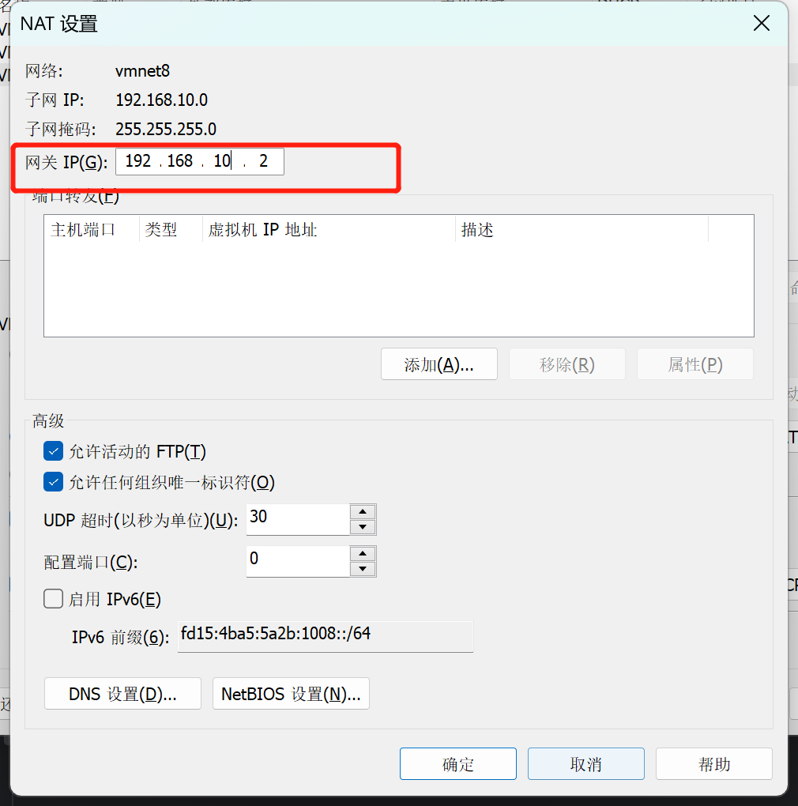

## 硬件部分

虚拟机处理器配置

任务管理器 -》 性能 -》 cpu -》打开资源监控器


CPU15 一共16个CPU，

那么此时我们，处理器内核总数不要超过我们的最高数字16


## 安装操作系统 略


记得先查看一下虚拟化。

# 编辑vm网络环境

编辑-》编辑虚拟网络


配置好网关，点击nat设置




网关要和子网IP一个频段


# 配置windows网络


双击IPV4	


记得一致


# 进入虚拟机系统

目录: vi /etc/sysconfig/network-scripts/ifcfg-ens33

```
TYPE="Ethernet"
PROXY_METHOD="none"
BROWSER_ONLY="no"
BOOTPROTO="static"
DEFROUTE="yes"
IPV4_FAILURE_FATAL="no"
IPV6INIT="yes"
IPV6_AUTOCONF="yes"
IPV6_DEFROUTE="yes"
IPV6_FAILURE_FATAL="no"
IPV6_ADDR_GEN_MODE="stable-privacy"
NAME="ens33"
UUID="833c0800-3d58-4b9c-b7ab-709d607d48d3"
DEVICE="ens33"
ONBOOT="yes"
IPADDR=192.168.10.101
GATEWAY=192.168.10.2
DNS1=192.168.10.2

```

配置映射

vim /etc/hosts

```
192.168.10.100 hadoop100
192.168.10.101 hadoop101
192.168.10.102 hadoop102
192.168.10.103 hadoop103
```

安装wget

```
yum install wget
```


# 配置JDK

```
#环境变量
cd /etc/profile.d
#创建自己的配置
vi my_env.sh 
```

内容

```
#JAVA_HOME
export JAVA_HOME=/java/jdk1.8.0_212
export PATH=$PATH:$JAVA_HOME/bin
```

适配

```
source /etc/profile
```


# 集群分发脚本

## 1）scp（secure copy）安全拷贝

（1）scp 定义

scp 可以实现服务器与服务器之间的数据拷贝。

（2）语法

```
scp  -r   $pdir/$fname          $user@$host:$pdir/$fname
命令 递归 要拷贝的文件路径/名称   目的地用户@主机:目的地路径/名称
```

# 防火墙        

## 一、防火墙的开启、关闭、禁用命令 

（1）设置开机启用防火墙：systemctl enable firewalld.service 

（2）设置开机禁用防火墙：systemctl disable firewalld.service 

（3）启动防火墙：systemctl start firewalld 

（4）关闭防火墙：systemctl stop firewalld 

（5）检查防火墙状态：systemctl status firewalld 

## 二、使用firewall-cmd配置端口 

（1）查看防火墙状态：firewall-cmd --state 

（2）重新加载配置：firewall-cmd --reload 

（3）查看开放的端口：firewall-cmd --list-ports 

（4）开启防火墙端口：firewall-cmd --zone=public --add-port=9200/tcp --permanent 

命令含义： 

–zone #作用域 

–add-port=9200/tcp #添加端口，格式为：端口/通讯协议 

–permanent #永久生效，没有此参数重启后失效 

注意：添加端口后，必须用命令firewall-cmd --reload重新加载一遍才会生效 

（5）关闭防火墙端口：firewall-cmd --zone=public --remove-port=9200/tcp --permanent              

# 清理磁盘空间

## 一、查看磁盘容量

1. 显示磁盘空间使用情况

```
df -lh  
```


2. 查看当前文件夹大小

```
du -sh
```


3. 查看当前所在目录的各子目录磁盘空间占用情况

```
du -sh *
```


4. 列出指定目录及其子目录中的所有文件和目录的大小，并按照文件大小从大到小排序，然后仅显示前 10 个最大的文件和目录

```
du -a /root/data | sort -n -r | head -n 10
```


5. 根据文件大小查找

/root/data目录下查找大小大于 100MB 的文件

```
find /root/data -size +100M -ls
```


在 /root/data 目录下搜索大小大于 100MB 且小于 200MB 的文件

```
find /root/data -size +100M -a -size -200M -ls
```


## 二、清理磁盘

1. 将文件内容清空

```
truncate -s 0 文件名
```


2. 删除文件 (谨慎!)

删除当前目录下以.log结尾的文件和文件夹

```
rm -rf *.log
```


## 三、清理Mysql  binlog

开发环境测试时有大批量数据插入,删除操作,binlog比较大, 又用不到想要清理一下. 不要直接删除, 进入mysql用mysql的命令去删

以下是清理过后的可以看到日志被删除了


1. 显示binglog列表

```
SHOW BINARY LOGS;
```


2. 删除binlog

删除binlog.000008之前的binlog

```
purge BINARY LOGS to 'binlog.000008';
```

