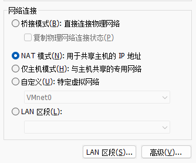
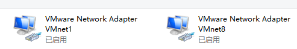
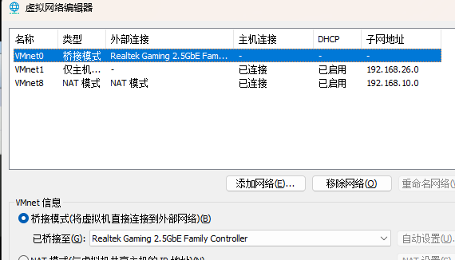
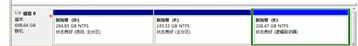
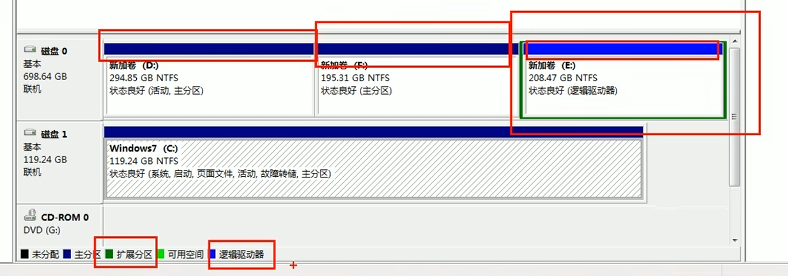
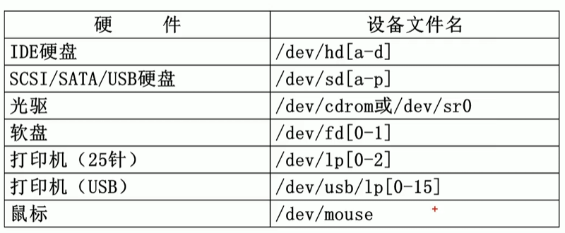
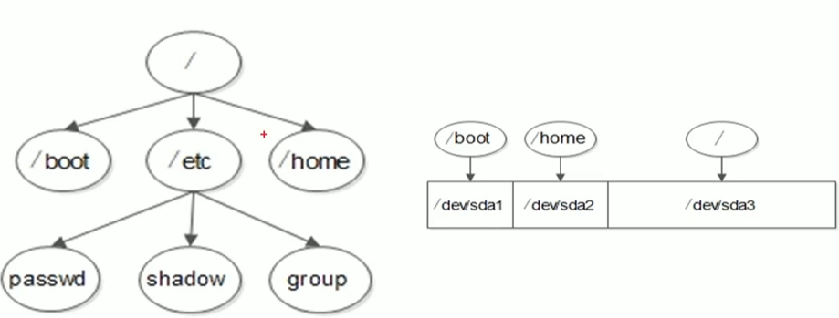
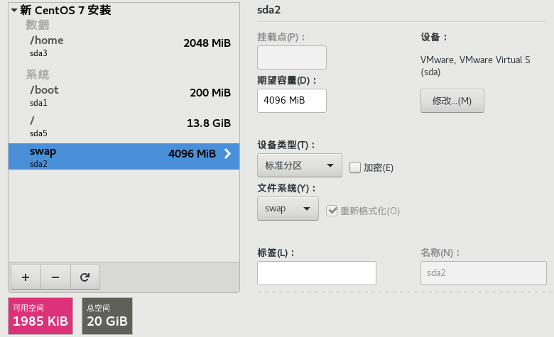
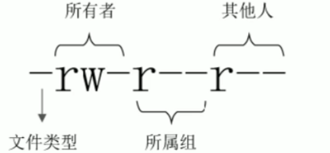
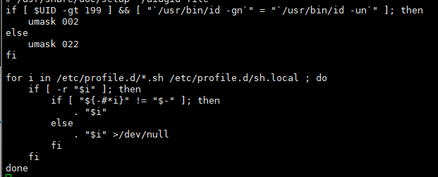

# Linux

## 前言:

这部分大致会分为几个阶段,可以搜索前往,懒得做超链接了

1. Linux基础篇
2. Shell编程
3. 系统管理
4. Linux服务管理
5. Linux MySQL管理
6. 集群
7. 虚拟化
8. K8S

## 一、Linux基础篇

### 1. 关于VMware虚拟机环境

#### 1.1 准备环境

官方网站 http://www.vmware.com,安装过程省略.

当然,如果你接受建议,那么笔者建议学习环境的配置如下图所示

- **CPU:** 建议主频为**1GHz**以上
- **内存:** 建议**1GB**以上
- **硬盘:** 建议分区空闲空间**8GB**以上

有钱建议直接阿里云

镜像站 -> https://mirrors.aliyun.com/centos

#### 1.2 虚拟机的网络配置

​		虚拟机的网络配置包含下图中的几种模式 :



​	当你在安装虚拟机的时候,在真实机中会出现两个虚拟网卡,那么尝试解读一下,常见的通信模式



- 桥接模式 -> 用于虚拟机与本机真实网卡链接进行通信,使用真实机器通信

- NAT模式 ->  使用虚拟网卡 VMnet8 通信

- 仅主机模式 -> 使用虚拟网卡 VMnet1 通信

  | 链接方式 | 链接网卡     | 是否能连接本机 | 是否能链接局域网 | 是否能链接公网 |
  | -------- | ------------ | -------------- | ---------------- | -------------- |
  | 桥接     | 本机真实网卡 | 可以           | 可以             | 可以           |
  | NAT      | VMnet8       | 可以           | 不能             | 可以           |
  | 仅主机   | VMnet1       | 可以           | 不能             | 不能           |
  
  注意,当你选择桥接模式的时候, 前往 编辑 -> 虚拟网络编辑器,编辑桥接模式使用的网卡
  
  

### 2. 系统的分区

#### 2.1 磁盘分区

​	用通俗异动的话来解释什么是磁盘分区,把一个大硬盘,分成一个一个小的逻辑硬盘就是分区,分区后的硬盘还是一整块硬盘.



分区的两种形式:

- **MBR 分区表 :**  最大支持 2.1 TB 硬盘,最多支持四个分区

  - 主分区: 最多只能有4个
  - 扩展分区:
    - 最多只能有1个
    - 主分区加扩展分区最多有4个
    - 不能写入数据,只能包含逻辑分区

  - 逻辑分区

  参考windows分区逻辑,如图

  

- **GPT 分区表 :** 全局唯一标示分区表,支持9.4 ZB硬盘,理论上支持的分区没有限制,但是在windows 限制128个主分区

#### 2.2 格式化

​		格式化(高级格式化),又称为逻辑格式化,根据用户选定的文件系统(例如FAT 16,FAT 32,NTFS,EXT 2,EXT 3,EXT4等等),在磁盘的特定区域写入特定数据,再分区中划出一片用于存放文件分配表,目录表等用于文件管理的磁盘空间

​		一般情况下 Linux 的文件系统是EXT4

#### 2.3 设备文件名



建议记住的分区设备文件名,a表示硬盘顺序 如上图,后面的数据为分区编号

- /dev/hda1 (IDE硬盘接口,这个年代一般情况下都是光驱用这个接口了)
- /dev/sda1 (SCSI硬盘接口,SATA硬盘接口,现在一般都是SATA,还有USB等)

#### 2.4 挂载点

- 必须分区:
  - / : 根分区
  - swap分区(交换分区) :
    - 建议如果真实内存小于4 GB,swap为内存的两倍
    - 建议如果真实内存大于4 GB,swap和内存一致
    - 建议实验环境不大于2 GB
- 推荐分区:
  - /boot (启动分区,1GB)
- 常用分区:
  - /home (用于文件服务器)
  - /www (用于WEB服务器)

​		Linux使用已存在的空目录作为挂载点,理论上所有的空目录都可以当挂载点,但是/bin、/lib、/etc 这些除外,他们必须与根目录在一个目录下

​		借用华罗庚老师的一句话,数形结合百般好,看图知关系



​		参考,学习过程中的分区挂载点配置,如下图所示



#### 2.5 密码原则

- 复杂性: 

  - 建议大于八位

  - 建议大小写,数字,符号最少包含其中三种

  - 建议不使用和个人信息相关的内容

  - 建议不使用现有的英文单词

- 易记忆性:

  - 建议你的超复杂密码记得住,比如 flzx_3QC、DF_3mzPite

### 3. 远程登录

#### 3.1 配置IP地址

​	考虑到你在这里没有vi or vim的编辑经验,那么假如你的Centos版本是6.3+,你就可以直接通过下面的指令设置IP地址,注意 setup 只有Centos有

```
[root@localhost ~]# setup
#通过setup工具设置IP地址,注意激活onboot=yes
[root@localhost ~]# service network restart
#重启网络服务
```

如果你会用虚拟机,那么就是直接梭哈

```
vi /etc/sysconfig/network-scripts/ifcfg-ens33
```

这里需要注意,1.2中选择的网卡根据网卡设置相对应的网络配置

```
TYPE="Ethernet"
PROXY_METHOD="none"
BROWSER_ONLY="no"
BOOTPROTO="static"
DEFROUTE="yes"
IPV4_FAILURE_FATAL="no"
IPV6INIT="yes"
IPV6_AUTOCONF="yes"
IPV6_DEFROUTE="yes"
IPV6_FAILURE_FATAL="no"
IPV6_ADDR_GEN_MODE="stable-privacy"
NAME="ens33"
UUID="833c0800-3d58-4b9c-b7ab-709d607d48d3"
DEVICE="ens33"
ONBOOT="yes"
//这里的配置根据1.2中的网卡设置即可
IPADDR=192.168.10.101
GATEWAY=192.168.10.2
DNS1=192.168.10.2
```

#### 3.2 安装日志

```
/root/install.log : 储存了安装在系统中的软件包及其版本信息
/root/install.log.syslog : 存储了安装过程中留下的时间记录
/root/anaconda-ks.cfg : 以Kickstart配置文件的格式记录安装过程中设置的选项信息,这玩意后续可以当模板用,做集群
```

### 4. 一些Linux的注意事项

1. Linux是严格区分大小写的
2. Linux 一切皆文件,都是一文件的形式保存的,硬件设备也是文件,Linux的设备文件保存在/dev/目录中,硬盘文件的/dev/sd[a-p]
3. Linux不靠扩展名区分文件类型,而是靠权限位标识来确定文件类型的,常见的文件类型只有 普通文件、 目录、链接文件、块设备文件、字符设备文件等集中,Linux的可执行文件不过就是普通文件被赋予了可执行权限,但是有些特殊文件要求写扩展名称用来分辨
   - 压缩包:Linux下常见的压缩文件有 .gz 、.zip 、.tar.gz等,方便判断
   - 二进制软件包: Centos中使用的而二进制安装包是RPM包,所有的RPM包都用 .RPM结尾,方便判断
   - 程序脚本: shell脚本一般以 .sh 结尾,还有其他例如 .c 结尾的C语言文件等
   - 网页文件: 一般以 .html 或者 .php结尾,按照网页服务器的要求设置
4. Linux中所有的存储设备都必须在挂载之后使用 

### 5.Linux的目录结构

#### 5.1 一级目录

| 目录名称    | 目录作用                                                     |
| :---------- | :----------------------------------------------------------- |
| /bin/       | 存放系统命令的目录,普通用户和超级用户都可以执行,是/usr/bin目录的软连接 |
| /sbin/      | 存放系统命令的目录,只有超级用户才可以执行,是/usr/sbin目录的软连接 |
| /usr/sbin   | 存放系统命令的目录,只有超级用户才可以执行                    |
| /usr/bin    | 存放系统命令的目录,普通用户和超级用户都可以执行              |
| /boot       | 系统启动目录,保存与系统启动相关的文件,比如内核文件和启动引导程序(grub) |
| /dev        | 保存设备文件目录                                             |
| /etc        | 配置文件保存位置,系统内所有采用默认安装(rpm安装)方式的服务配置文件全部保存在此目录中,如用户信息,服务的启动脚本,常用的服务配置文件等 |
| /home       | 普通用户的家目录,在创建用户时,每个用户要有一个默认登陆和保存自己数据的位置,就是用户目录,所有普通用户的宿主目录实在/home下建立一个和用户名相同的目录,例如 用户 W1T 的home即为 /home/W1T/ |
| /lib        | 系统调用的函数库保存位置,是 /usr/lib的软连接                 |
| /lost+found | 当系统意外崩溃或者及其意外关机,会产生一些文件碎片在这里,当系统启动过程中fsck工具会检查到这里,并修复损坏的文件系统,这个目录只在每个分区中出现 |
| /media      | 挂载目录,系统建议用来挂载媒体设备,比如软盘,光盘              |
| /misc       | 挂载目录。系统建议用来挂载 NFS 服务的共享目录。系统虽然准备了三个默认挂载目录/media、/mnt、/misc，但是到底在哪个目录中挂载什么设备都可以由管理员自己决定。尽量养成在/mnt 下建立不同目录挂载不同设备的习惯。如/mnt/cdrom 挂载光盘，/mnt/usb 挂载 U盘的习惯 |
| /mnt        | 挂载目录,早期Linux只有这一个目录,没有细分,现在系统建议这个目录来挂载额外的设备,比如U盘,移动硬盘和其他操作系统分区 |
| /opt        | 第三方软件的安装位置,不过我还是比较适应/usr/local            |
| /proc       | 虚拟文件系统,该目录的数据并不保存在硬盘上,而是保存在内存中,主要保存系统内核,进程,外部设备状态和网络状态等 |
| /sys        | 虚拟文件系统,主要保存内核相关信息                            |
| /root       | root的宿主目录                                               |
| /run        | 系统运行时产生的数据,比如ssid,pid等相关数据,/var/run是此目录的软连接 |
| /selinux    | 用来设定 限制root权限的组件                                  |
| /srv        | 服务数据目录                                                 |
| /tmp        | 临时目录                                                     |
| /usr        | UNIX Software Resource,存放系统软件资源的目录,系统级的应用大多数保存在这里 |

#### 5.2 二级目录

| 二级目录         | 目录作用                                                     |
| ---------------- | ------------------------------------------------------------ |
| /usr/lib         | 应用程序调用的函数库保存位置                                 |
| /usr/local       | 手工安装的软件保存位置,我们一般建议把源码包软件安装在这个位置 |
| /usr/share       | 应用程序的资源文件保存位置,比如帮助文档,说明文档,字体等资源  |
| /usr/src         | 存放源程序,比如下载的源码包,内核源码,一般手工下载的源码包保存在/usr/local/src 中,把内核源码保存到/usr/src/kernels目录下 |
| /usr/src/kernels | 内核源码保存位置                                             |
| /var             | 动态数据保存位置,比如缓存,日志,软件运行产生的文件            |
| /var/www/html    | RPM包安装的Apache的网页目录                                  |
| /var/lib         | /程序运行中需要调用或改变的数据保存位置,比如mysql数据库保存在/var/lib/mysql目录中 |
| /var/log         | 系统日志保存位置                                             |
| /var/run         | 一些服务和成勋运行后,PID保存位置,是/run目录的软连接          |
| /var/spool       | 队列数据目录,就是排队等待其他程序使用的数据                  |
| /var/spool/mail  | 新收到邮件队列保存位置                                       |
| /var/spool/cron  | 定时任务队列保存位置                                         |

#### 5.3 关于服务器

##### 5.3.1 远程服务器注意事项

1. 远程服务器,不能关机,只能重启.你就想想看,是不是得按开机键
2. 远程服务器在重启前,要中止正在执行的服务,强制断电时硬盘没有进行数据交互
3. 重启命令建议使用 "shutdown -r now" ,这条命令再重启时会正常保存和中止服务器中正常运行的程序,是安全重启命令,而且最好在重启之前执行几次 "sync"数据同步命令,可以让暂时保存在内存的数据持久化在磁盘上
4. 不要再服务器访问高峰运行高负载命令,参考备份
5. 指定合理的密码规范并且定期更新
6. 合理的分配权限
7. 定期备份重要数据和日志
8. 配置防火墙的时候不要把自己踢出服务器.重要的事情说一遍

这里提一句,防火墙

防火墙的基本功能是数据包过滤,当前主流的过滤方案是

- IP地址
- MAC地址
- 端口号
- 协议类型
- 数据包中的数据

由于Linux 的防火墙是纯手工命令,所以配置规则和命令比较复杂,这里就要注意上述的问题,建议在服务器本地配置防火墙,这样就算不小心把自己的远程登陆过滤了,还可以通过本机登录来恢复,如果服务器已经在远程登陆配置防火墙,那么最好在本地测试后再上传,或者你写个定时任务,五分钟清一次防火墙规则,就算是出问题也有反悔的机会

### 6. 常用命令

#### 6.1 命令的基本格式

```
[root@localhost ~]#
```

- [] : 提示符分隔符,没有实际意义
- root : 显示当前登录用户
- @ :" 分隔符
- localhost: 当前系统的简写主机名
- ~ : 代表当前用户所在的目录
- #: 命令提示符,超级用户是# 普通用户是$

命令的基本格式

```
[root@localhost ~]# 命令 [选项] [参数]
```

常规的操作命令(cat,touch,mkdir,cd,ls)这里跳过

#### 6.2 ln链接

链接命令,对于初学者来说比较复杂,如果你是已经入门的开发者,那就是两个文件指向了一个地址,了解即可

关于链接,首先要了解Linux的文件系统,简单可以理解为 key -> value ,一个地址指向一个文件,然后一个文件名指向一个地址,这样可以通过一个目录找到一个文件地址,从而找到这个文件块,那么如果当两个文件名(A,B)指向同一个地址时,互相均可以改动文件块

参考以下demo

```
[root@localhost ~]# touch fileA
[root@localhost ~]# ln fileA fileB
[root@localhost ~]# cat fileA
//fileA is null
[root@localhost ~]# cat fileb
//fileB is null
[root@localhost ~]# echo insert one row into fileb >> fileB 
[root@localhost ~]# cat fileA 
insert one row into fileb
[root@localhost ~]# 

```

值得一提的是 ,他们的地址都是一样的

```
[root@localhost ~]# ls -il
25166215 -rw-r--r--. 2 root root    0 8月  23 21:21 fileA
25166215 -rw-r--r--. 2 root root    0 8月  23 21:21 fileb
```

那么在上面的demo中,我们得知了一个新的命令:ln

```
[root@localhost ~]# ln --help
用法：ln [选项]... [-T] 目标 链接名	(第一种格式)
　或：ln [选项]... 目标		(第二种格式)
　或：ln [选项]... 目标... 目录	(第三种格式)
　或：ln [选项]... -t 目录 目标...	(第四种格式)
```

那么在这里,我们可以思考,假设我删除了其中一个文件,那么会不会影响到另一个文件的读取写入呢?

这里引入一个新的概念,硬链接与软连接的区别

**硬链接**:

1. 源文件和硬链接拥有**相同**的Inode和Block
2. 修改任意一个文件,另一个都改变
3. 删除任意一个文件,另一个都可用
4. 硬链接标记不清晰,比较难以确认链接文件位置,不建议使用
5. 硬链接不能链接目录,不能跨分区链接

**软链接**:

1. 源文件和硬链接拥有**不同**的Inode和Block
2. 修改任意一个文件,另一个都改变
3. 删除软连接,原文件不受影响,删除源文件,软连接报废
4. 软连接没有实际数据,只保存源文件的地址,不管原文件多大,软连接大小不变
5. 软连接的权限是最大权限,但是最终访问问需要参考源文件权限
6. 可以跨分区,可以链接目录,特征明显

上面概念,参考深拷贝与浅拷贝

### 7. 基本权限管理

#### 1.权限的介绍

​	**权限位置的含义**

​	我们可以看一下,查看权限时候的样子

```
[root@localhost /]# ll
lrwxrwxrwx.   1 root root    7 8月  17 21:34 bin -> usr/bin
```

"lrwxrwxrwx." 这一坨就是屈权限标志位,意义如下:



基本权限为 10 位,

1. 第一位,文件类型,常见如下
   - **"-"**:普通文件
   - **"b"**: 块设备文件,存储设备一般都是这种文件,例如分区文件/dev/sda1
   - **"c"**:字符设备文件,输入设备常用例如鼠标键盘
   - **"d"**: 目录文件
   - **"l"**: 软连接文件
   - **"p"**: 管道符文件,一种少见的特殊设备文件
   - **"s"**: 套接字文件,一些服务支持Socket访问会产生这样的文件
2. 剩下九位,每三位一组,分别代表,所属者(u),所有组(g),其他人的权限(o),对应的角色每有一个字母 对应着一个权限,如果对应位置是 -  则代表无此项权限
   - **"r"** : 代表read 只读
   - **"w"**: 代表 write 写入
   - **"x"**: 代表 execute,执行权限

至于后面这个点,经过 linux 的文档查询得知为该文件受SELinux(美国国安局开发的安全系统)保护,知道就行影响不大

#### 2.基本权限命令

```
命令名称: chmod (change file mode bits)
所在路径: /bin/chmod
执行权限: 所有用户
命令格式:
[root@localhost /]# chmod [选项] 权限模式 文件名
选项: 
	  -c, --changes          like verbose but report only when a change is made
  -f, --silent, --quiet  suppress most error messages
  -v, --verbose          output a diagnostic for every file processed
      --no-preserve-root  do not treat '/' specially (the default)
      --preserve-root    fail to operate recursively on '/'
      --reference=RFILE  use RFILE's mode instead of MODE values
  -R, --recursive        change files and directories recursively
      --help		显示此帮助信息并退出
      --version		显示版本信息并退出
```

#### 3.权限模式

```
chmod命令的权限格式是
[用户身份][赋予方式][权限]
用户身份:
	u : user
	g : group
	o : other
	a : all
赋予方式:+,-,= ->> 添加,减去,设置
权限: 参考7.1
```

#### 4.数字权限

​	数字权限很简单,但是不如字母好记,直观

- 4: 代表**"r"**权限
- 2: 代表**"w"**权限
- 1: 代表**"x"**权限

常用权限

- 644: 文件基本权限 ->> u = r w _ , g=r_ _, o=r _ _
- 755: 文件执行权限 ->> u = r w x , g=r_ x, o=r _ x
- 777: 文件最大权限 ->> u = r w x , g=r w x, o=r w x

### 8. 所有者 和 所属组

#### 1. chown

更改所有者 和 所属组的命令

```
[root@localhost ~]#  chown [选项] 所有者:所属组 文件or目录
选项: 参考 --help
```

注意: 普通用户不能修改文件的所有者,哪怕自己是这个为文件的所有者都不行,但是普通用户可以修改所有者是自己的文件权限

#### 2. chgrp

更改所属组

```
[root@localhost ~]#  chgrp [选项] 所属组 文件or目录
选项: 参考 --help
```

#### 3. 对于权限的解析

首先，读、写、执行权限对文件和目录的作用是不同的。

权限对文件的作用:

- 读(r): 对文件有读(r) 权限，代表可以读取文件中的数据。如果把权限对应到命令上，那么一旦对文件有读(r) 权限，就可以对文件执行 cat、more、less、head、tail 等文件查看命令。

- 写(w): 对文件有写(w)权限，代表可以修改文件中的数据。如果把权限对应到命令上,那么一旦对文件有写 (w)权限，就可以对文件执行 vim、echo 等修改文件数据的命令。注意:**对文件有写权限，是不能删除文件本身的，只能修改文件中的数据。如果想删除文件，则需要对文件的上级目录拥有权限,就个人理解而言,linux万物皆为文件,目录下的文件,本身为目录自身的文件内容**

- 执行 (x):  对文件有执行 (x)权限，代表文件拥有了执行权限，可以运行。在 Linux 中,只要文件有执行 (x) 权限，这个文件就是执行文件了。只是这个文件到底能不能正确执行不仅需要执行 (x)权限，还要看文件中的代码是不是正确的语言代码。对文件来说，执行(x)权限是最高权限。

权限对目录的作用。

- 读(r) : 对目录有读(r)权限，代表可以查看目录下的内容，也就是可以查看目录下有哪些子文件和子目录。如果把权限对应到命令上，那么一旦对目录拥有了读 (r) 权限，就可以在目录下执行 Is 命令，查看目录下的内容了。
- 写(w) : 对目录有写(r)权限，代表可以修改目录下的数据，也就是可以在目录中新建、删除、复制、剪切子文件或子目录。如果把权限对应到命令上，那么一旦对目录拥有了写(w)权限，就可以在目录下执行 touch、rm、cp、mv 命令。对目录来说，写 (w) 权限是最高权限。
-  执行(x):目录是不能运行的，那么对目录拥有执行(x)权限，代表可以进入目录。如果把权限对应到命令上，那么一旦对目录拥有了执行 (x) 权限，就可以对目录执行 cd命令，进入目录。

#### 4.umask 默认权限

​		我们来看一下,什么是umask,在默认路径下 新建一个文件,保证不操作他的权限,你会看到,在我们不操作权限的情况下,linux会给我们安排默认权限

```
[wyt@localhost ~]$ ll
总用量 0
-rw-rw-r--. 1 wyt wyt 0 9月   3 20:20 default_umask.txt
[wyt@localhost ~]$ 
```

查看系统的umask权限:

```
[root@localhost wyt]# umask
0002
#用八进制显示umask权限
[root@localhost wyt]# umask -S
u=rwx,g=rwx,o=rx
#字母表示
```

在了解umask的计算方法之前,我们得先知道如何计算umask

- 对文件来讲,新建的文件默认最大权限为 666 ,没有执行权限,执行权限必须通过用户手工赋予
- 对于目录来讲,新建目录默认最大为 777

linux 的固安房标准算法为二进制进行卢欧几与非运算才能得到默认权限,一般情况下我们的计算公式可以这样理解,**umask默认计算权限,不能直接用数字相减**

```
#为文件的默认权限最大只能是 666 ,而umask 的值为 0022 ,那么
"-rw-rw-rw-" 减去 "-----w--w-" 默认权限为 "-rw-r--r--"
#为目录的默认权限最大只能是 777 ,而umask 的值为 0022 ,那么
"drwxrwxrwx" 减去 "-----w--w-" 默认权限为 "drwxr-xr-x"
```

系统默认的umask设置




### 9. 帮助命令

看看这章,观察一下linux官方的解释,比国内c**n不知道好了多少

#### 1. man 命令

man是最常见的帮助命令,也是Linux最主要的

```
format and display the on-line manual pages
Usage: man [OPTION...] [章节] 手册页...

  -C, --config-file=文件   使用该用户设置文件
  -d, --debug                输出调试信息
  -D, --default              将所有选项都重置为默认值
      --warnings[=警告]    开启 groff 的警告
```

**man命令涉及的快捷键**

| 快捷键  | 作用                                                 |
| ------- | ---------------------------------------------------- |
| ↑       | 向上一行                                             |
| ↓       | 向下一行                                             |
| Pg Up   | 向上翻一页                                           |
| Pg Dn   | 向下翻一页                                           |
| g       | 移动到第一页                                         |
| G       | 移动到最后一页                                       |
| q       | 推出                                                 |
| /字符串 | 从当前页向下搜索                                     |
| ?字符串 | 从当前页向上搜索                                     |
| n       | 当搜索字符串,使用找到下一个目标字符串                |
| N       | 当搜索字符串,使用找到反向目标字符串,根据搜索方式决定 |

**man命令的帮助级别,这里知道就行**

| 级别 | 作用                                       |
| ---- | ------------------------------------------ |
| 1    | 普通用户可以执行的系统命令和可执行文件帮助 |
| 2    | 内核可以调用的函数和工具帮助               |
| 3    | C语言函数帮助                              |
| 4    | 设备和特殊文件帮助                         |
| 5    | 配置文件帮助                               |
| 6    | 游戏帮助(Linux 个人版)                     |
| 7    | 杂项帮助                                   |
| 8    | 超级用户可以执行的系统命令帮助             |
| 9    | 内核帮助                                   |

```
#查看命令拥有哪个级别的帮助
man -f [命令] 或者 whatis [命令]

#查看命令相关的所有帮追
man -k [命令] 或者 apropos [命令]
```


#### 2. info 命令

info 命令的帮助信息是一套完整的资料,每个命令的帮助信息只是这套问问完整资料中的某个小章节

**

| 快捷键 | 作用                      |
| ------ | ------------------------- |
| ↑      | 向上一行                  |
| ↓      | 向下一行                  |
| Pg Up  | 向上翻一页                |
| Pg Dn  | 向下翻一页                |
| g      | 移动到第一页              |
| G      | 移动到最后一页            |
| q      | 推出                      |
| tab    | 在有"*"符号的节点间且耳环 |
| enter  | 进入有"*"符号的子页面查看 |
| u      | 进入上一层                |
| n      | 进入下一小节              |
| p      | 进入上一小节              |
| ?      | 查看帮助                  |
| q      | 退出                      |


#### 3. help 命令

help 只能获得Shell内置的命令帮助,基本信息:

- 所在路径: Shell 内置命令
- 执行权限: 所有用户
- 用来显示Shell内置命令的帮助,可以使用type来区分内置或者外部命令

#### 4. --help 选项

绝大多数命令都可以使用此命令查看帮助,也是一种快捷的方法,例如:

```
[root@localhost wyt]# ll --help
用法：ls [选项]... [文件]...
List information about the FILEs (the current directory by default).
Sort entries alphabetically if none of -cftuvSUX nor --sort is specified.
Mandatory arguments to long options are mandatory for short options too.
  -a, --all			不隐藏任何以. 开始的项目
  -A, --almost-all		列出除. 及.. 以外的任何项目
      --author			与-l 同时使用时列出每个文件的作者
  -b, --escape			以八进制溢出序列表示不可打印的字符
      --block-size=SIZE      scale sizes by SIZE before printing them; e.g.,
                               '--block-size=M' prints sizes in units of
                               1,048,576 bytes; see SIZE format below
...
```


### 10. 搜索命令

#### 1. whereis

​	whereis 是搜索系统命令的命令,whereis命令不能搜索普通文件,只能查找二进制命令,源文件,以及帮助文档的命令

```
[root@localhost wyt]# whereis vi
vi: /usr/bin/vi /usr/share/man/man1/vi.1.gz
[root@localhost wyt]# whereis ls
ls: /usr/bin/ls /usr/share/man/man1/ls.1.gz
```

#### 2. which

​	which 也是搜索系统命令的命令,只能查找二进制命令,区别在于

- whereis 可以查找命令的同时,查找到帮助文档的位置
- which 可以查找到别名

```
[root@localhost wyt]# which ls
alias ls='ls --color=auto'
	/usr/bin/ls
[root@localhost wyt]# whereis ls
ls: /usr/bin/ls /usr/share/man/man1/ls.1.gz
```

#### 3. locate 

locate 命令是可以按照文件名搜索普通文件的命令。讲道理这个我没用过

- 优点: 按照数据库搜索，搜索速度快，消耗资源小。数据库位置/var/lib/mlocate/mlocate.db
- 缺点:只能按照文件名来搜索文件，而不能执行更复杂的搜索，比如按照权限、大小、修改时间等搜索文件

#### 4. find

todo
