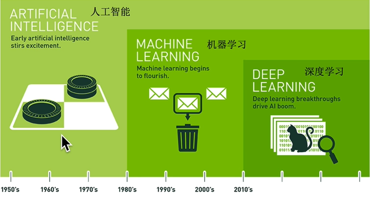
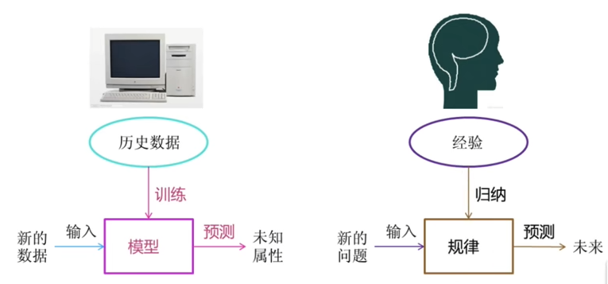
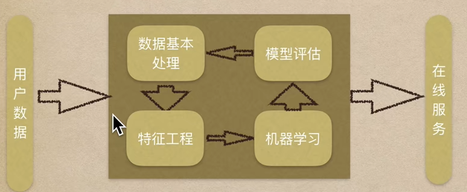
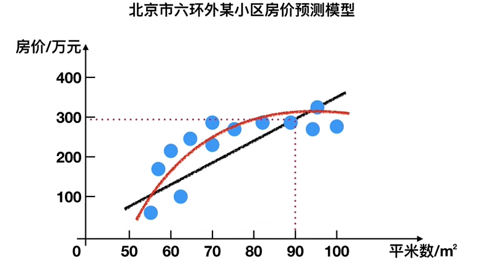
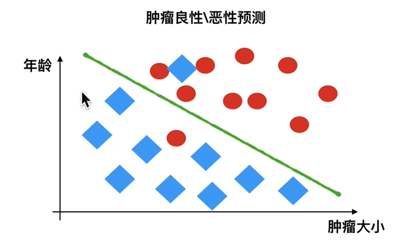
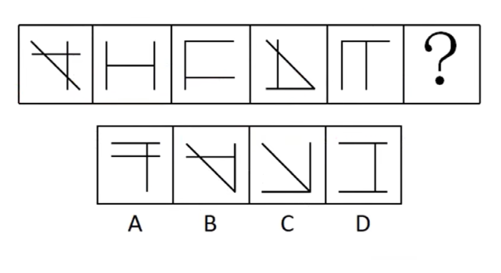
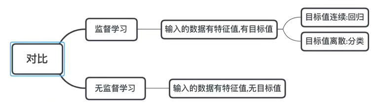
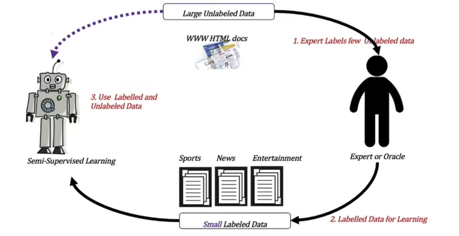
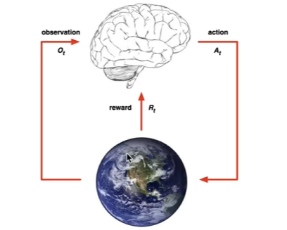

## 深度学习与卷积神经网络

### 1. 导论

人工智能的必备三要素: 数据,算法,算力

前要: 人工智能, 机器学习,深度学习的关系



机器学习是人工智能的一个实现途径,深度学习是机器学习的一个方法扩展

**关于人工智能的主要分支**

1. 计算机视觉(CV)

2. 自然语言处理(NLP)

   ​	在NLP领域, 分为为**文本挖掘/分类**,**机器翻译**和**语音识别**

3. 机器人

**关于机器学习工作流程**

机器学习从数据中自动分析获得模型,并利用模型对未知数据进行预测



机器学习理想化工作流程



在机器学习种的工作流程分支,将数据抽象为表格,那么,对应的关键词解释如下

- 抽象数据
  - 一行数据为一个**样本**
  - 一列数据为一个特征
  - 数据随机附带**目标值(标签值)**
- 数据类型分类
  - 数据类型1: 特征值 + 目标值 (目标值是连续的和离散的)
  - 数据类型2: 只有特征值, 没有目标值
- 理论数据划分
  - 机器学习的训练集一般会划分两个部分
    - 训练数据: 用于训练,**构建模型**
    - 测试数据: 检验模型,用于**评估**是否有效
  - 常规划分比例
    - 训练集: **70% 80% 75%**
    - 测试集: **30% 20% 25%**
- 数据的基本处理 -> 除杂,剪枝
- 特征工程
  - 特征提取
    - 将数据(比如文本,图像) 转换为可以用于机器学习的数字特征
  - 特征预处理
    - 通过一些**转换函数**,将特征数据**转换为更加合适的算法模型**的过程,参考摘要算法
  - 特征降维
    - 在某些限定条件下,**降低随机变量(特征)个数**,得到一组**不相关主变量**的过程,参考世界地图

#### 1.1 机器学习算法与模型分类

根据常用的数据集组成不同,可以把机器学习算法分为以下几种

- 监督学习
- 无监督学习
- 半监督学习
- 强化学习

先来看监督学习

##### 1.1.1 监督学习

定义: 输入数据是由输入特征值和目标值所组成

1. 函数的输出可以是一个连续的值(回归值)
2. 输出是有限个离散值(分类)

**分类一---回归问题**

例题, 预测放假,根据样本集,模拟出一条连续曲线



**分类二---分类问题**

例题,根据肿瘤特征,进行预测



##### 1.1.2 无监督学习

定义: 输入数据是由输入特征值,没有目标值

1. 输入数据没有被标记,也没有确定的结果,样本类别未知
2. 需要根据样本的相似性对样本集分类,参考公务员找规律的题目

例:

有监督,无监督算法对比如下



##### 1.1.3 半监督学习

定义: 训练集同时包含有标记样本数据和未标记样本数据

参考谷歌的论文附图吧,之前做验证码的标记类似



##### 1.1.4 强化学习

定义: make decisions 问题,即自动做出决策,并可以连续做出决策

举个例子,比如阿尔法狗,把他比做人下围棋,不仅要判断自己先后手,还要判断小飞还是板粘打吃,那么 阿尔法狗在这里即位 **agent**,他试图采取下一步**行动**,来模拟环境下棋行为,并且从**一个状态转换到下一个状态**,完成任务得到奖励

这里包含了为五个元素: agent, action, reward, environment, observation ; 来看看谷歌的图



对比

|            |         in         |    out     |       目的       |       案例        |
| :--------: | :----------------: | :--------: | :--------------: | :---------------: |
|  监督学习  |       有标签       |   有反馈   |     预测结果     | 分类算法,回归算法 |
| 无监督学习 |       无标签       |   无返回   |   发现潜在机构   |     卷积算法      |
| 半监督学习 |     有部分标签     |   有反馈   | 降低数据标记难度 |    爬虫验证等     |
|  强化学习  | 决策流程及奖励机制 | 一系列行动 |  长期利益最大化  |       围棋        |


#### 1.2 模型评估

- 分类模型评估

  - 预测正确的数据占样本总数的比例
    - 其他评价指标: 精确率,召回率,F1-Score,AUC等

- 回归模型评估

  - 均方根误差:

  - $$
    RMSE = \sqrt{\frac{\sum_{i=1}^{n} (p_{i} - a_{i} )}{n}}
    $$

    

  - a = actual target
    p = predicted target

  举例

  ```
  假设房价预测问题,有五个样本,对应值为
  真实值:100,120,125,230,400
  预测值:105,119,120,230,410
  那么使用均方根误差求解得到
  ```

  $$
  5.495 = \sqrt{\frac{(100-105)^2+(120-119)^2+5^2+0^2+10^2}{n}}
  $$

  - 当然,还有其他的指标评价,例如:
    - 相对平方误差
    - 平均绝对误差
    - 相对绝对误差
    - ...

### 2. 机器学习-环境搭建

查看电脑的显卡型号是否支持CUDA的安装
https://developer.nvidia.com/zh-cn/cuda-gpus

查看可以安装的CUDA版本
https://docs.nvidia.com/cuda/cuda-toolkit-release-notes/index.html

CUDA安装地址
https://developer.nvidia.com/cuda-toolkit-archive

Anaconda下载地址
https://www.anaconda.com/products/individual

更换Anaconda的安装包下载源
https://mirrors.tuna.tsinghua.edu.cn/help/anaconda/

